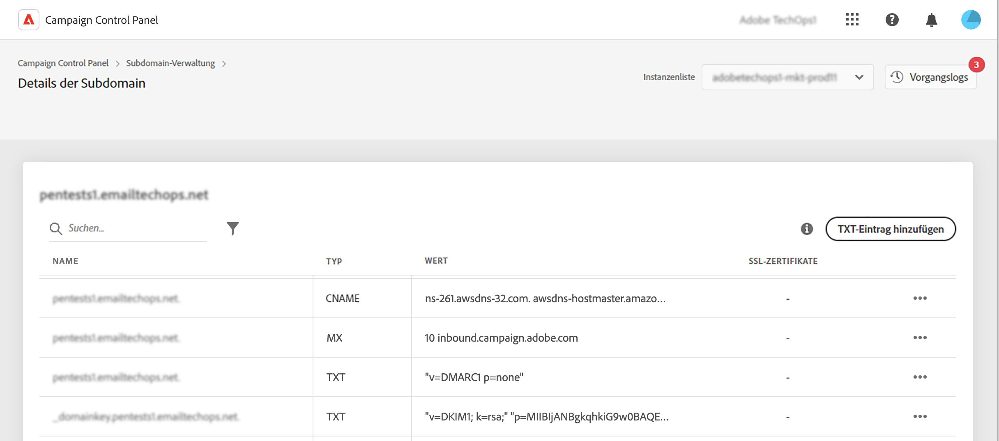

# Erste Schritte mit TXT-Einträgen {#managing-txt-records}

>[!CONTEXTUALHELP]
>id="cp_siteverification_add"
>title="Verwalten von TXT-Einträgen"
>abstract="TXT-Einträge sind eine Art von DNS-Einträgen, die der Bereitstellung von Textinformationen zu einer Domain dienen und von externen Quellen gelesen werden können. Mit dem Control Panel können Sie Ihren Subdomains drei Arten von Datensätzen hinzufügen: Google Site Verification, DMARC und BIMI-Datensätze."

## Über TXT-Einträge {#about}

TXT-Einträge sind eine Art von DNS-Einträgen, die der Bereitstellung von Textinformationen zu einer Domain dienen und von externen Quellen gelesen werden können. Im Control Panel können Sie Ihren Subdomains drei Datensatztypen hinzufügen:

* **TXT-Einträge für Google** Sie können bestätigen, dass Sie Ihre Domain besitzen, indem Sie hohe Posteingangsraten und niedrige Spam-Raten für Ihre E-Mails sicherstellen. [Erfahren Sie, wie Sie TXT-Einträge für Google hinzufügen](managing-txt-records.md)
* **DMARC-Einträge** bieten eine Möglichkeit, die Domain des Absenders zu authentifizieren und die unbefugte Nutzung der Domain für böswillige Zwecke zu verhindern. [Erfahren Sie, wie Sie DMARC-Datensätze hinzufügen](dmarc.md)
* **BIMI-Datensätze** ermöglichen es Ihnen, ein bestätigtes Logo neben Ihren E-Mails in den Postfächern von Postfachanbietern anzuzeigen, um die Markenerkennung und das Vertrauen zu verbessern. [Erfahren Sie, wie Sie BIMI-Datensätze hinzufügen](bimi.md)

## Überwachen der Datensätze Ihrer Subdomains {#monitor}

Sie können alle TXT-Einträge überwachen, die für jede Subdomain hinzugefügt wurden, indem Sie auf die Details der Subdomains zugreifen.

In diesem Bildschirm werden alle TXT-Einträge für die ausgewählte Subdomain mit Informationen in der Spalte &quot;Wert&quot; ihrer Konfiguration angezeigt. Um einen Google TXT-, DMARC- oder BIMI-Datensatz zu löschen, klicken Sie auf die Suchschaltfläche und wählen Sie dann Löschen aus. Sie können bei Bedarf auch DMARC- und BIMI-Datensätze bearbeiten.

