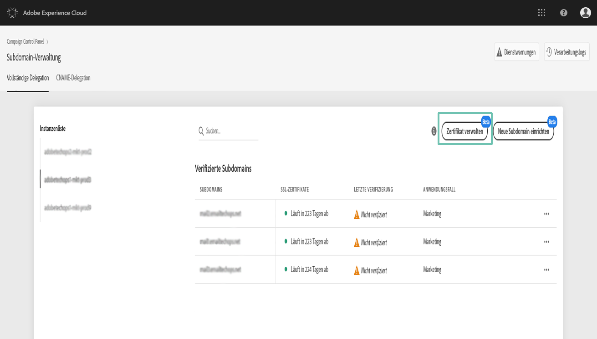
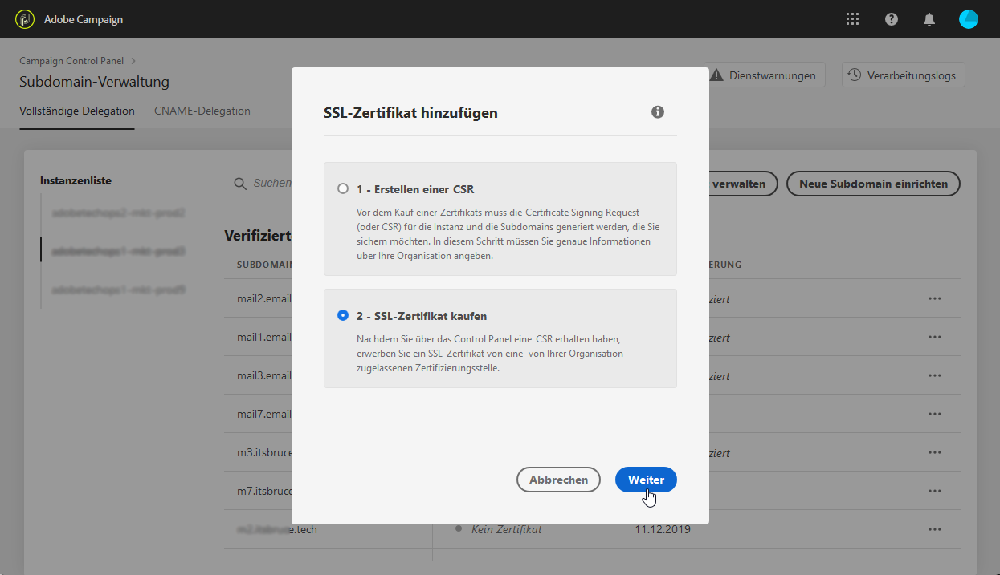
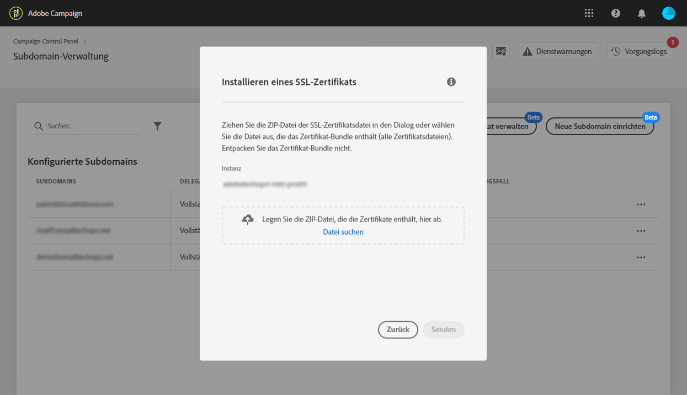

# Installieren des SSL-Zertifikats {#installing-ssl-certificate}

>[!CONTEXTUALHELP]
>id="cp_install_ssl_certificate"
>title="Installation eines SSL-Zertifikats"
>abstract="Installieren Sie das SSL-Zertifikat, das Sie bei der von Ihrem Unternehmen zugelassenen Zertifizierungsstelle erworben haben."
>additional-url="https://experienceleague.adobe.com/docs/control-panel/using/subdomains-and-certificates/subdomains-branding.html?lang=de" text="Über Subdomain-Branding"

Sobald Sie ein SSL-Zertifikat gekauft haben, können Sie es auf Ihrer Instanz installieren. Bevor Sie fortfahren, achten Sie auf folgende Voraussetzungen:

* Die Certificate Signing Request (CSR) muss über das Control Panel generiert worden sein. Andernfalls können Sie das Zertifikat nicht über das Control Panel installieren.
* Die Certificate Signing Request (CSR) sollte mit der Subdomain übereinstimmen, die für die Verwendung mit Adobe konfiguriert wurde. Sie kann beispielsweise nicht mehr Subdomains enthalten als die konfigurierte.
* Das Datum des Zertifikats muss aktuell sein. Es ist nicht möglich, Zertifikate mit einem Datum in der Zukunft zu installieren. Zertifikate dürfen nicht abgelaufen sein (d. h. gültiges Start- und Enddatum).
* Das Zertifikat muss von einer vertrauenswürdigen Zertifizierungsstelle (CA) wie Comodo, DigiCert, GoDaddy usw. ausgestellt sein.
* Die Größe des Zertifikats darf maximal 2048 Bit betragen und der Algorithmus muss vom Typ RSA sein.
* Das Zertifikat muss im X.509 PEM-Format vorliegen.
* SAN-Zertifikate werden unterstützt.
* Wildcard-Zertifikate werden nicht unterstützt.
* Die ZIP-Datei bzw. das Zertifikat darf nicht passwortgeschützt sein.
* Die ZIP-Datei darf – möglichst in einzelnen Dateien – nur Folgendes enthalten:
   * End-Entity-Zertifikat.
   * Intermediate-Zertifikatskette (in der richtigen Reihenfolge angeordnet).
   * Root-Zertifikat (optional).

Gehen Sie wie folgt vor, um das Zertifikat zu installieren:

1. Wählen Sie zuerst auf der Karte **[!UICONTROL Subdomains &amp; Zertifikate]** die gewünschte Instanz und danach **[!UICONTROL Zertifikat verwalten]** aus.

   

1. Wählen Sie **[!UICONTROL 3 - Zertifikat-Bundle installieren]** und dann **[!UICONTROL Weiter]** aus, um den Assistenten zu starten, der Sie durch den Zertifikatinstallationsprozess führt.

   

1. Wählen Sie die .zip-Datei aus, die das zu installierende Zertifikat enthält, und wählen Sie danach **[!UICONTROL Senden]** aus.

   

>[!NOTE]
>
>Das Zertifikat wird in allen in der CSR enthaltenen Domains/Subdomains installiert. Zusätzliche Domains/Subdomains, die im Zertifikat vorhanden sind, werden nicht berücksichtigt.

Nach der Installation des SSL-Zertifikats werden das Gültigkeitsdatum und das Statussymbol des Zertifikats entsprechend aktualisiert.
