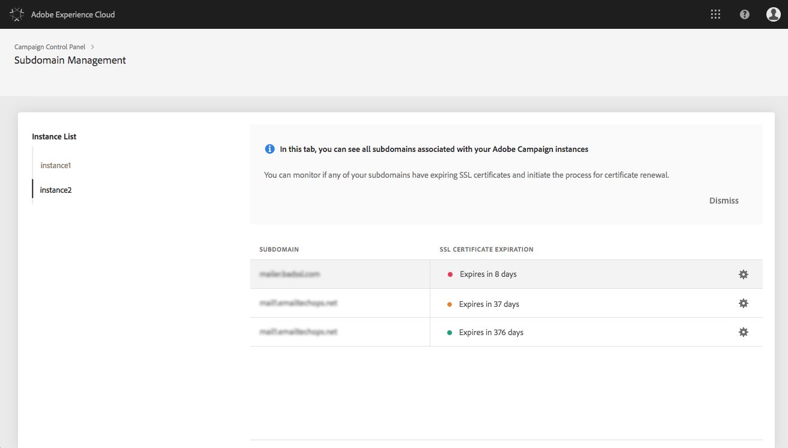

# SSL-Zertifikate von Sub-Domains verwalten {#managing-subdomains-ssl-certificates}

Die Karte **[!UICONTROL Sub-Domains und Zertifikate]bietet einen Überblick darüber, auf welchen Ihrer Sub-Domains und verbundenen Sub-Domains Landingpages und Ressourcen mit installierten SSL-Zertifikaten gehostet werden.** Außerdem erkennen Sie auf einen Blick, welche Sub-Domains Zertifikate haben, die demnächst ablaufen, sodass Sie rechtzeitig informiert sind.

Sie können dann vor Ablaufen eines Zertifikats bei der Adobe-Kundenunterstützung durch Bereitstellung aller erforderlicher Informationen einen Antrag auf Verlängerung des Zertifikats stellen, damit Ihre Instanz auch weiterhin ordnungsgemäß funktioniert.

>[!NOTE]
>
>Adobe empfiehlt, das SSL-Zertifikat der zugehörigen Subdomänen zu verlängern, **wenn das Ablaufdatum näher rückt**. Die Verlängerung eines Zertifikats kann je nach Unternehmen einige Tage dauern. Wir empfehlen daher, für diesen Vorgang eine entsprechende Dauer einzuplanen.

## SSL-Zertifikate überwachen {#monitoring-ssl-certificates}

Über die Karte **[!UICONTROL Sub-Domains &amp; Zertifikate]können Sie unmittelbar auf die Liste der Sub-Domains für jede Ihrer Instanzen zugreifen.**

Die Sub-Domains sind nach dem nächsten Ablaufdatum des SSL-Zertifikats geordnet, wobei das Ablaufdatum in Tagen optisch dargestellt wird:

* **Grün**: Das Zertifikat der Sub-Domain läuft nicht innerhalb der nächsten 60 Tage ab.
* **Orange**: Mindestens eine Sub-Domain hat ein Zertifikat, das innerhalb der nächsten 60 Tage abläuft.
* **Rot**: eine oder mehrere Subdomänen über ein Zertifikat verfügen, das innerhalb der nächsten 30 Tage abläuft.

Um weitere Details zu den Zertifikaten einer Subdomäne abzurufen, klicken Sie auf die Schaltfläche **[!UICONTROL Zertifikatdetails]**.

Die Liste aller verbundener Sub-Domains wird auf den jeweiligen Zertifikaten angezeigt. Normalerweise sind dies Sub-Domains von Landingpages, Seiten mit Ressourcen usw.

Bei Bedarf können Sie in diesem Fenster die Verlängerung eines Zertifikats beantragen. Weiterführende Informationen hierzu finden Sie im folgenden Abschnitt.

## SSL-Zertifikatverlängerung starten {#initiating-ssl-certificate-renewal}

>[!NOTE]
>
>Das Control Panel verwaltet nicht automatisch die Verlängerung von Zertifikaten. It only allows you to **initiate the renewal process** by preparing the request to be sent to Adobe Campaign Customer Care.

Der Verlängerungsprozess eines SSL-Zertifikats besteht aus drei Schritten:

1. **Erstellung des Certificate Signing Request (CSR)** Die Adobe-Kundenunterstützung erstellt einen CSR für Sie, je nach dem Antrag, den Sie über das Kundenunterstützungsportal eingereicht haben. Darauf müssen Sie alle für die Erstellung eines CSR erforderlichen Informationen bereitstellen (z. B. Gebrauchsname, Organisationsname und Adresse). Im Control Panel finden Sie die Liste der erforderlichen Informationen, wenn Sie den Verlängerungsprozess starten. Weiterführende Informationen hierzu finden Sie im folgenden Abschnitt.
1. **Kauf des SSL-Zertifikats** Nachdem die Kundenunterstützung den CSR erstellt hat, können Sie diesen herunterladen und damit das SSL-Zertifikat bei der von Ihrem Unternehmen verwendeten Zertifizierungsstelle kaufen.
1. **Installation des SSL-Zertifikats** Nach dem Kauf des SSL-Zertifikats müssen Sie dieses für die Adobe-Kundenunterstützung verfügbar machen. Das Zertifikat wird installiert und Sie sehen im Control Panel das aktualisierte Ablaufdatum des Zertifikats.

Gehen Sie wie folgt vor, um die Erneuerung der SSL-Zertifikate in der Systemsteuerung zu starten:

1. Öffnen Sie die Karte **[!UICONTROL Subdomänen &amp; Zertifikate]** und klicken Sie dann auf das Symbol **[!UICONTROL Zertifikatdetails]** der Subdomäne, deren Zertifikate bald ablaufen.

   

1. Daraufhin wird eine Liste verwandter Subdomänen angezeigt. Sie beinhaltet normalerweise Subdomänen von Einstiegsseiten, Ressourcenseiten usw.
Klicken Sie auf die Schaltfläche **[!UICONTROL Ticket-Details]**, um den Vorgang zur Erneuerung der Zertifikate zu starten.

   

1. Ein Formular mit allen für die Verlängerung des SSL-Zertifikats erforderlichen Feldern wird angezeigt. Alle Felder müssen vollständig und richtig ausgefüllt werden (kontaktieren Sie bei Bedarf Ihr Team oder die Sicherheits- und IT-Abteilung). Andernfalls kann keine Zertifikatsignaturanforderung generiert werden, und Sie können das Zertifikat nicht verlängern.

   * **[!UICONTROL IMS-Organisation]**: die Kennung Ihres Unternehmens
   * **[!UICONTROL Instanz]**: URL der Campaign-Instanz, die mit Ihrer Sub-Domain verbunden ist
   * **[!UICONTROL Allgemeiner Name]**: Hierbei handelt es sich in der Regel um eine Tracking-Subdomäne-URL, die der Subdomäne mit dem abgelaufenen Zertifikat zugeordnet ist.
   * **[!UICONTROL Subdomänen]**: Subdomänen, die mit einem abgelaufenen Zertifikat mit der Subdomäne verknüpft sind. Wenn Sie dasselbe SSL-Zertifikat auf andere Sub-Domains anwenden möchten, können Sie sie zu dieser Liste hinzufügen. Achten Sie in diesem Fall darauf, dass diese Sub-Domains mit derselben IMS-Organisation und Instanzen-URL verbunden sind.
   >[!CAUTION]
   >
   >Die Felder **[!UICONTROL IMS-Organisation]** und **Instanz]werden automatisch vom Control Panel ausgefüllt und dürfen nicht verändert werden.[!UICONTROL **

   

1. Once the form is completed, click the **[!UICONTROL Copy Details]** button to save the information to your Clipboard.

   >[!NOTE]
   >
   >Wenn Sie Ihren Browserverlauf nicht löschen, werden die eingegebenen Informationen gespeichert, sodass Sie das Zertifikat später verlängern können.

1. Click the **[!UICONTROL Log new ticket]** button. Sie werden automatisch auf die Anmeldeseite der Adobe Campaign-Kundenunterstützung weitergeleitet.

   

1. Melden Sie sich an und erstellen Sie ein neues Support-Ticket. Schreiben Sie in den Betreff "SSL certificate CSR request" (CSR-Beantragung eines SSL-Zertifikats).
Fügen Sie alle Informationen, die Sie zuvor kopiert haben, im Hauptteil des Tickets ein und wählen Sie dann Submit (Senden) aus.

   >[!NOTE]
   >
   >Wenn Sie nicht berechtigt sind, Support-Tickets für Ihr Unternehmen aufzugeben, übermitteln Sie alle von Ihnen in die Zwischenablage kopierten Informationen an den für Sie zuständigen Support-Mitarbeiter mit der Bitte, ein neues Kundenunterstützungs-Ticket für Sie zu eröffnen.

**Verwandte Themen:**

* [Tutorial für Campaign Standard](https://docs.adobe.com/content/help/en/campaign-learn/campaign-standard-tutorials/administrating/control-panel/managing-ssl-certificates.html)
* [Tutorial für Campaign Classic](https://docs.adobe.com/content/help/en/campaign-learn/campaign-classic-tutorials/administrating/control-panel-acc/managing-ssl-certificates.html)
