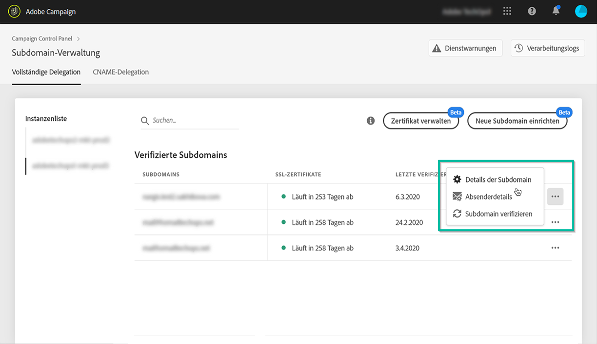

# Verwalten von TXT-Einträgen {#managing-txt-records}

>[!CONTEXTUALHELP]
>id="cp_siteverification_add"
>title="Verwalten von TXT-Einträgen"
>abstract="Bei bestimmten Diensten wie Google müssen Sie Ihren Domain-Einstellungen einen TXT-Eintrag hinzufügen, um zu verifizieren, dass Sie der Besitzer der Domain sind."

## Über TXT-Einträge {#about-txt-records}

TXT-Einträge sind eine Art von DNS-Einträgen, die der Bereitstellung von Textinformationen über eine Domain dienen und von externen Quellen gelesen werden können.

Für hohe Posteingangsraten und niedrige Spam-Raten setzen bestimmte Dienste wie Google voraus, dass Sie Ihren Domain-Einstellungen einen TXT-Eintrag hinzufügen, um zu verifizieren, dass Sie der Besitzer der Domain sind.

Gmail gehört derzeit zu den beliebtesten Anbietern von E-Mail-Adressen. Für optimale Zustellbarkeit und einen erfolgreichen Versand von E-Mails an Gmail-Adressen können Sie Ihren Subdomains mit Adobe Campaign spezielle TXT-Einträge der Websiteüberprüfung von Google hinzufügen, um für ihre Verifizierung zu sorgen.

 Entdecken Sie diese Funktion im Video mit [Campaign Classic](https://experienceleague.adobe.com/docs/campaign-classic-learn/control-panel/subdomains-and-certificates/google-txt-record-management.html?lang=de#subdomains-and-certificates) oder [Campaign Standard](https://experienceleague.adobe.com/docs/campaign-standard-learn/control-panel/subdomains-and-certificates/google-txt-record-management.html?lang=de#subdomains-and-certificates).

## Hinzufügen eines Google TXT-Eintrags für eine Subdomain {#adding-a-google-txt-record}

Gehen Sie wie folgt vor, um Ihrer Subdomain, die Sie zum Versenden von E-Mails an Gmail-Adressen nutzen, einen Google TXT-Eintrag hinzuzufügen:

1. Navigieren Sie zur Karte **[!UICONTROL Subdomains und Zertifikate]**.

1. Wählen Sie Ihre Instanz aus und öffnen Sie dann die Details der Subdomain, der Sie einen DNS-Eintrag hinzufügen möchten.

   

1. Klicken Sie auf die Schaltfläche **[!UICONTROL TXT-Eintrag hinzufügen]** und geben Sie dann den Wert ein, der in den G Suite Admin-Tools generiert wurde. Weiterführende Informationen finden Sie in der [G Suite Admin-Hilfe](https://support.google.com/a/answer/183895).

   

1. Klicken Sie zur Bestätigung auf die Schaltfläche **[!UICONTROL Hinzufügen]**.

   

Nachdem der TXT-Eintrag hinzugefügt wurde, müssen Sie ihn von Google verifizieren lassen. Rufen Sie dazu die G Suite Admin-Tools auf und starten Sie dann den Verifizierungsschritt (siehe [G Suite Admin-Hilfe](https://support.google.com/a/answer/183895)).

Um einen Eintrag zu löschen, wählen Sie ihn in der Liste der Einträge aus und klicken Sie dann auf die Schaltfläche „Entfernen“.

>[!NOTE]
>
>Der einzige Eintrag, den Sie aus der Liste der DNS-Einträge löschen können, ist derjenige, den Sie zuvor hinzugefügt haben (in unserem Fall der Google TXT-Eintrag).
