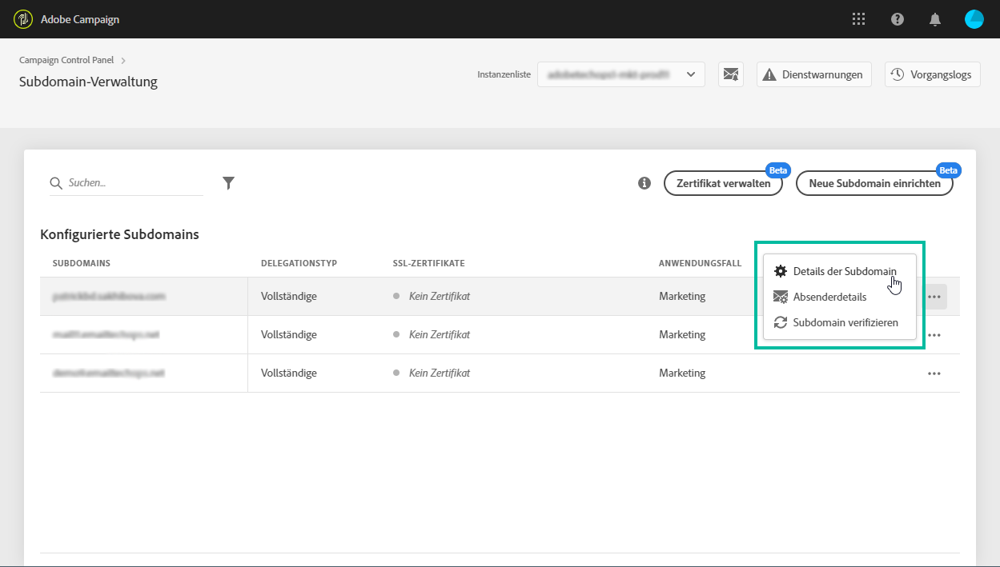
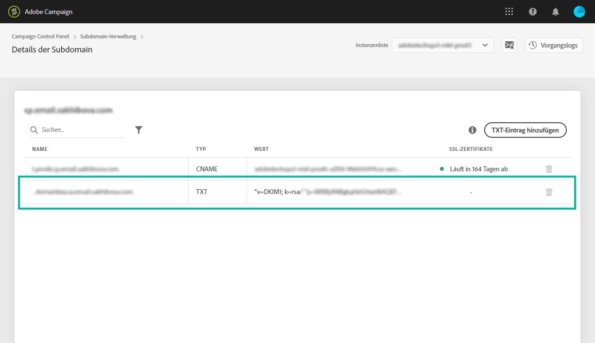

# Verwalten von TXT-Datensätzen {#managing-txt-records}

>[!CONTEXTUALHELP]
>id=&quot;cp_siteVerification_add&quot;
>title=&quot;Verwalten von TXT-Datensätzen&quot;
>abstract=&quot;Bei einigen Diensten wie Google müssen Sie Ihren Domäneneinstellungen einen TXT-Datensatz hinzufügen, um sicherzustellen, dass Sie Eigentümer der Domäne sind.&quot;

## Informationen zu TXT-Datensätzen {#about-txt-records}

TXT-Datensätze sind eine Art DNS-Datensätze, die zur Bereitstellung von Textinformationen über eine Domäne verwendet werden, die von externen Quellen gelesen werden können.

Um hohe Posteingangsraten und niedrige Spam-Raten sicherzustellen, müssen einige Dienste wie Google Ihren Domäneneinstellungen einen TXT-Datensatz hinzufügen, um sicherzustellen, dass Sie Eigentümer der Domäne sind.

Gmail gehört derzeit zu den beliebtesten Anbietern von E-Mail-Adressen. Um eine gute Lieferbarkeit und einen erfolgreichen Versand von E-Mails an Gmail-Adressen sicherzustellen, können Sie mit Adobe Campaign Ihren Subdomänen besondere TXT-Verifizierungs-TXT-Datensätze für Google-Sites hinzufügen, um sicherzustellen, dass diese verifiziert werden.

## Hinzufügen eines Google TXT-Datensatzes für eine Subdomäne {#adding-a-google-txt-record}

Gehen Sie wie folgt vor, um Ihrer Subdomäne, die zum Versenden von E-Mail-Adressen verwendet wird, einen Google TXT-Datensatz hinzuzufügen:

1. Navigieren Sie zur **[!UICONTROL Subdomain and Certificates]** Karte.

1. Wählen Sie die Instanz aus und öffnen Sie dann die Details der Subdomäne, der Sie einen DNS-Datensatz hinzufügen möchten.

   

1. Klicken Sie auf die **[!UICONTROL Add TXT record]** Schaltfläche und geben Sie dann den in den G Suite Admin Tools generierten Wert ein. Weitere Informationen finden Sie in der [G Suite Admin-Hilfe](https://support.google.com/a/answer/183895).

   

1. Klicken Sie zur Bestätigung auf die **[!UICONTROL Add]** Schaltfläche.

   

Nachdem der TXT-Datensatz hinzugefügt wurde, müssen Sie ihn von Google überprüfen lassen. Navigieren Sie dazu zu den Admin Tools der G Suite und starten Sie dann den Verifizierungsschritt (siehe [G Suite Admin-Hilfe](https://support.google.com/a/answer/183895)).

Um einen Datensatz zu löschen, wählen Sie ihn in der Liste &quot;Datensätze&quot;aus und klicken Sie dann auf die Schaltfläche &quot;Entfernen&quot;.

>[!NOTE]
>
>Der einzige Datensatz, den Sie aus der Liste der DNS-Datensätze löschen können, ist der, den Sie zuvor hinzugefügt haben (in unserem Fall der Google TXT-Datensatz).
