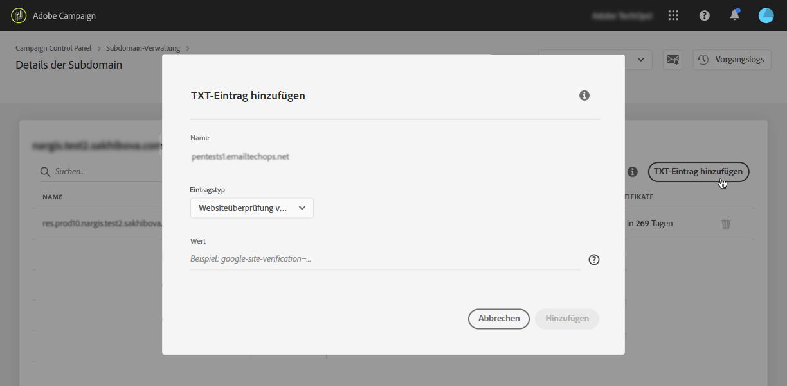

# Hinzufügen von Google Site-Verifizierungseinträgen {#adding-a-google-txt-record}

Für hohe Posteingangsraten und niedrige Spam-Raten setzen bestimmte Dienste wie Google voraus, dass Sie Ihren Domain-Einstellungen einen TXT-Eintrag hinzufügen, um zu verifizieren, dass Sie der Besitzer der Domain sind.

Gmail gehört derzeit zu den beliebtesten Anbietern von E-Mail-Adressen. Für optimale Zustellbarkeit und einen erfolgreichen Versand von E-Mails an Gmail-Adressen können Sie Ihren Subdomains mit Adobe Campaign spezielle TXT-Einträge der Websiteüberprüfung von Google hinzufügen, um für ihre Verifizierung zu sorgen.

Gehen Sie wie folgt vor, um Ihrer Subdomain, die Sie zum Versenden von E-Mails an Gmail-Adressen nutzen, einen Google TXT-Eintrag hinzuzufügen:

1. Klicken Sie in der Liste der Subdomains auf die Schaltfläche mit den Auslassungspunkten neben der gewünschten Subdomain und wählen Sie **[!UICONTROL Details der Subdomain]**.

1. Klicken Sie auf die Schaltfläche **[!UICONTROL TXT-Eintrag hinzufügen]** und wählen Sie **[!UICONTROL Google Site-Überprüfung]** aus der Dropdown-Liste **[!UICONTROL Typ des Eintrages]**.

1. Geben Sie den in den G Suite-Administrationswerkzeugen generierten Wert ein. Weiterführende Informationen finden Sie in der [G Suite Admin-Hilfe](https://support.google.com/a/answer/183895).

   

1. Klicken Sie zur Bestätigung auf die Schaltfläche **[!UICONTROL Hinzufügen]**.

   

Nachdem der TXT-Eintrag hinzugefügt wurde, müssen Sie ihn von Google verifizieren lassen. Rufen Sie dazu die G Suite Admin-Tools auf und starten Sie dann den Verifizierungsschritt (siehe [G Suite Admin-Hilfe](https://support.google.com/a/answer/183895)).

Um einen Eintrag zu löschen, wählen Sie ihn in der Liste der Einträge aus und klicken Sie dann auf die Schaltfläche „Entfernen“.

>[!NOTE]
>
>Der einzige Eintrag, den Sie aus der Liste der DNS-Einträge löschen können, ist derjenige, den Sie zuvor hinzugefügt haben (in unserem Fall der Google TXT-Eintrag).

 Erkunden Sie diese Funktion von [Campaign v7/v8](https://experienceleague.adobe.com/docs/campaign-classic-learn/control-panel/subdomains-and-certificates/google-txt-record-management.html?lang=de#subdomains-and-certificates) oder [Campaign Standard](https://experienceleague.adobe.com/docs/campaign-standard-learn/control-panel/subdomains-and-certificates/google-txt-record-management.html?lang=de#subdomains-and-certificates) im Video.
