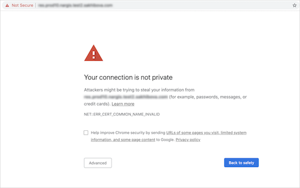
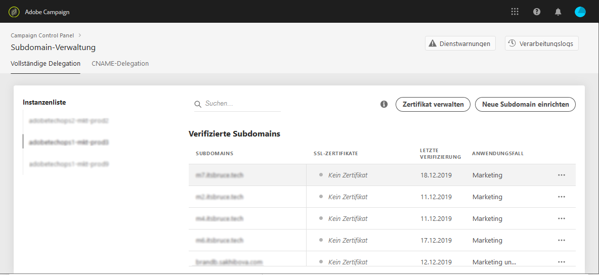

# Monitoring subdomains&#39; SSL certificates {#monitoring-ssl-certificates}

## Über SSL-Zertifikate {#about-ssl-certificates}

Adobe Campaign empfiehlt, die Subdomains zu schützen, die Ihre Landingpages hosten, insbesondere jene, die sensible Kundendaten erfassen.

Mit der **SSL-Verschlüsselung (Secure Socket Layer)** stellen Sie sicher, dass die Adobe zugewiesenen Subdomains sicher sind. Wenn Ihr Kunde ein Web-Formular ausfüllt oder eine von Adobe Campaign gehostete Landingpage besucht, werden die Daten standardmäßig über ein nicht-sicheres Protokoll (HTTP) übertragen. Verwenden Sie zur Datenübertragung ein HTTPS-Protokoll, um besseren Schutz zu gewährleisten. Ihre Subdomain-Adresse &quot;http://info.mywebsite.com/&quot; würde dann &quot;https://info.mywebsite.com/&quot; lauten.

**SSL-Zertifikate sind nicht auf den zugewiesenen Subdomains selbst installiert**. Sie sind auf verbundenen Subdomains installiert, darunter vor allem auf jenen, die Landingpages oder Seiten mit Ressourcen hosten.

**SSL-Zertifikate werden für einen bestimmten Zeitraum bereitgestellt** (1 Jahr, 60 Tage usw.). Wenn ein Zertifikat abgelaufen ist, können Probleme beim Zugriff auf die Landingpages oder bei der Verwendung von auf der Subdomain vorhandenen Ressourcen auftreten. Um dies zu verhindern, können Sie über das Control Panel die SSL-Zertifikate Ihrer Subdomains überwachen und eine Verlängerung beantragen.

## Überwachung von SSL-Zertifikaten {#monitoring-certificates}

Der Status der SSL-Zertifikate Ihrer Subdomänen ist direkt in der Liste der Subdomänen verfügbar, wenn Sie die Karte &quot; **[!UICONTROL Subdomänen und Zertifikate]**&quot;auswählen.

Die Subdomains sind nach dem nächsten Ablaufdatum des SSL-Zertifikats geordnet, wobei das Ablaufdatum in Tagen optisch dargestellt wird:

* **Grün**: Das Zertifikat der Subdomain läuft nicht innerhalb der nächsten 60 Tage ab.
* **Orange**: Mindestens eine Subdomain hat ein Zertifikat, das innerhalb der nächsten 60 Tage abläuft.
* **Rot**: Mindestens eine Subdomain hat ein Zertifikat, das innerhalb der nächsten 30 Tage abläuft.
* **Grau**: Für die Subdomäne wurde kein Zertifikat installiert.

To get more details on a subdomain, click the **[!UICONTROL Subdomain Details]**button.
Die Liste aller verwandten Subdomänen wird angezeigt. Normalerweise sind dies Subdomains von Landingpages, Seiten mit Ressourcen usw.

Die Registerkarte &quot; **[!UICONTROL Sender-Info]**&quot;enthält Informationen zu den konfigurierten Postfächern (Sender, Antwort auf, Fehler-E-Mail).

Wenn eines der SSL-Zertifikate Ihrer Subdomäne abläuft, können Sie es direkt über die Systemsteuerung erneuern. Weitere Informationen finden Sie in diesem Abschnitt: Verlängerung [des SSL-Zertifikats](../../subdomains-certificates/using/renewing-subdomain-certificate.md)einer Subdomäne

>[!NOTE]
>
>Die Erneuerung der Zertifikate über die Systemsteuerung wird in Kürze in der Beta-Version verfügbar sein. In der Zwischenzeit finden Sie auf [dieser Seite](https://helpx.adobe.com/campaign/kb/control-panel-subdomains-certificates.html) weitere Informationen zum Überwachen von Zertifikaten in der Systemsteuerung.
