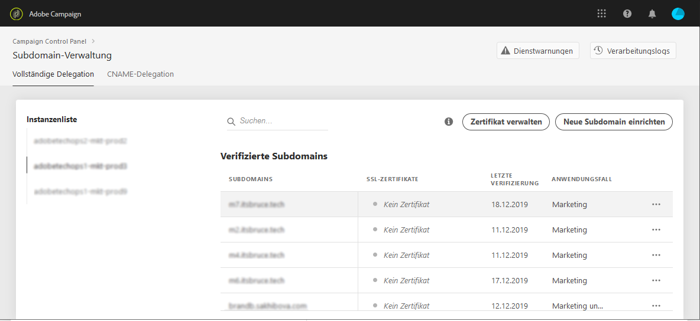
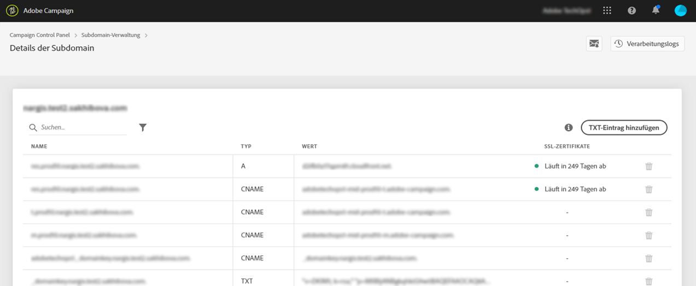

# Überwachen von SSL-Zertifikaten der Subdomains {#monitoring-ssl-certificates}

## Über SSL-Zertifikate {#about-ssl-certificates}

Adobe Campaign empfiehlt, die Subdomains zu schützen, die Ihre Landingpages hosten, insbesondere jene, die sensible Kundendaten erfassen.

Mit der **SSL-Verschlüsselung (Secure Socket Layer)** stellen Sie sicher, dass die Subdomains, die Sie für die Verwendung mit Adobe konfiguriert haben, sicher sind. Wenn Ihr Kunde ein Web-Formular ausfüllt oder eine von Adobe Campaign gehostete Landingpage besucht, werden die Daten standardmäßig über ein nicht-sicheres Protokoll (HTTP) übertragen. Verwenden Sie zur Datenübertragung ein HTTPS-Protokoll, um besseren Schutz zu gewährleisten. Ihre Subdomain-Adresse &quot;http://info.mywebsite.com/&quot; würde dann &quot;https://info.mywebsite.com/&quot; lauten.

**SSL-Zertifikate sind nicht auf den konfigurierten Subdomains selbst installiert**. Sie sind auf verbundenen Subdomains installiert, darunter vor allem auf jenen, die Landingpages oder Seiten mit Ressourcen hosten.

**SSL-Zertifikate werden für einen bestimmten Zeitraum bereitgestellt** (1 Jahr, 60 Tage usw.). Wenn ein Zertifikat abgelaufen ist, können Probleme beim Zugriff auf die Landingpages oder bei der Verwendung von auf der Subdomain vorhandenen Ressourcen auftreten. Um dies zu verhindern, können Sie über das Control Panel die SSL-Zertifikate Ihrer Subdomains überwachen und eine Verlängerung beantragen.

## SSL-Zertifikatverwaltung {#management}

Die Überwachung von SSL-Zertifikaten ist wichtig, um die Sicherheit Ihrer Subdomains zu gewährleisten. Über das Control Panel können Sie die SSL-Zertifikate Ihrer Subdomains direkt selbst installieren und erneuern oder diese Aufgabe an Adobe delegieren, damit dies automatisch und ohne Ihr Eingreifen geschieht.

Es wird dringend empfohlen, die Verwaltung der SSL-Zertifikate Ihrer Subdomains an Adobe zu delegieren, da Adobe das Zertifikat automatisch ausstellt und jedes Jahr vor Ablauf erneuert. Dadurch wird das Risiko von Fehlern verringert, die bei der manuellen Verwaltung von Zertifikaten auftreten können. [Erfahren Sie, wie Sie SSL-Zertifikate von Subdomains an Adobe delegieren](delegate-ssl.md)

Nachfolgend finden Sie eine umfassende Liste der Auswirkungen, die mit der manuellen Zertifikatsverwaltung im Vergleich zur Delegierung dieses Vorgangs an Adobe verbunden sind:

|       | Kundenverwaltetes Zertifikat | Adobe-verwaltetes Zertifikat |
|  ---  |  ---  |  ---  |
| Zertifikatsanbieter | Zertifizierungsstellen von Drittanbietern | Adobe über AWS Certificate Manager |
| Manuelle Schritte | CSR-Generierung, Zertifikatkauf und -installation | Kein(e) |
| Erneuerungsprozess | Verantwortung des Kunden | Verwaltet von Adobe |
| Subdomain-Sicherheit | Die Domain kann ungesicherte Subdomains haben (Tracking, Mirror und Res), es sei denn, Sie installieren/erneuern Zertifikate. | Bei jeder neuen Domain (sofern sie von Adobe verwaltet wird) sind alle Subdomains standardmäßig abgesichert. |
| Zertifikatskosten | Der Kunde trägt die Kosten für Zertifikate | Frei |

## Überwachen von SSL-Zertifikaten {#monitoring-certificates}

>[!CONTEXTUALHELP]
>id="cp_subdomain_details"
>title="Details der Subdomain"
>abstract="Rufen Sie Informationen zu den SSL-Zertifikaten Ihrer Subdomains ab."

Der Status der SSL-Zertifikate Ihrer Subdomains ist direkt in der Liste der Subdomains verfügbar, wenn Sie die Karte **[!UICONTROL Subdomains &amp; Zertifikate]** auswählen.

Die Subdomains sind nach dem nächsten Gültigkeitsdatum des SSL-Zertifikats geordnet, wobei das Gültigkeitsdatum in Tagen optisch dargestellt wird:

* **Grün**: Das Zertifikat der Subdomain läuft nicht innerhalb der nächsten 60 Tage ab.
* **Orange**: Mindestens eine Subdomain hat ein Zertifikat, das innerhalb der nächsten 60 Tage abläuft.
* **Rot**: Mindestens eine Subdomain hat ein Zertifikat, das innerhalb der nächsten 30 Tage abläuft.
* **Grau**: Für die Subdomain wurde kein Zertifikat installiert.

Wählen Sie die Schaltfläche **[!UICONTROL Details der Subdomain]** aus, um weitere Details zu einer Subdomain zu erhalten.
Die Liste aller zugehörigen Subdomains wird angezeigt. Normalerweise sind dies Subdomains von Landingpages, Seiten mit Ressourcen usw.

Die Registerkarte **[!UICONTROL Absenderdetails]** enthält Informationen zu den konfigurierten Postfächern (Absender-, Antwort-, Fehler-E-Mail).

Wenn eines der SSL-Zertifikate Ihrer Subdomain bald abläuft, können Sie es direkt im Control Panel verlängern. Weitere Informationen dazu finden Sie in diesem Abschnitt: [Verlängern des SSL-Zertifikats einer Subdomain](../../subdomains-certificates/using/renewing-subdomain-certificate.md).

**Verwandte Themen:**

* [Verlängern des SSL-Zertifikats einer Subdomain](../../subdomains-certificates/using/renewing-subdomain-certificate.md)
* [Subdomain-Branding](../../subdomains-certificates/using/subdomains-branding.md)
