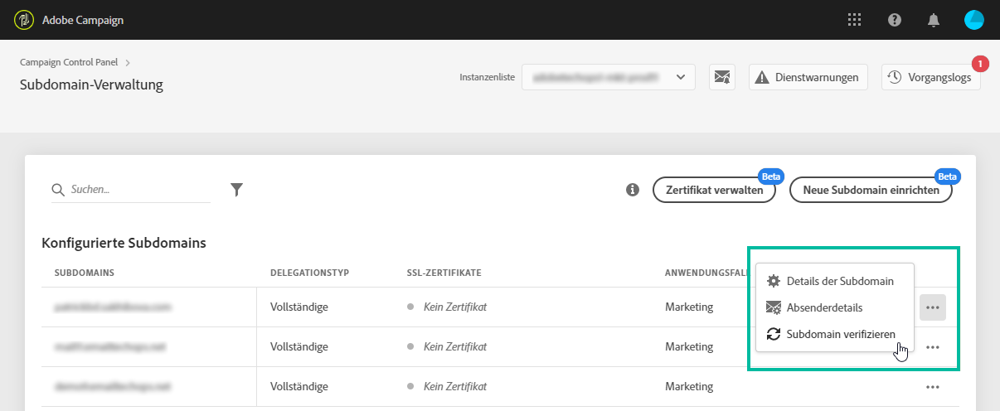

# Überwachen Ihrer Subdomains {#monitoring-subdomains}

Sie müssen Ihre Subdomains unbedingt überwachen, um sicherzustellen, dass alle ordnungsgemäß für die Verwendung mit Adobe Campaign konfiguriert sind.

Die Liste der Subdomains für jede Ihrer Produktionsinstanzen ist direkt verfügbar, wenn Sie die Karte **[!UICONTROL Subdomains &amp; Zertifikate]**auswählen.

The **[!UICONTROL Last verification]**column indicates when a subdomain was verified for the last time. Sie können eine Verifizierung jederzeit starten, indem Sie die Schaltfläche**...**/**[!UICONTROL  Subdomain verifizieren]** auswählen.

>[!CAUTION]
>
>Adobe empfiehlt die Verwendung von Subdomänen ohne Zertifikatdatum nicht, da dies bedeuten könnte, dass diese Subdomänen möglicherweise Probleme mit der Bereitstellung haben.

Beim Starten einer Überprüfung werden verschiedene Vorgänge ausgeführt, um zu überprüfen, ob die Subdomäne korrekt konfiguriert ist (Prüfung des Instanzenanwärters, E-Mail-Versand-Test usw.)

Wenn die Überprüfung der Subdomäne fehlschlägt, wenden Sie sich für weitere Informationen an den Adobe-Kundendienst.
