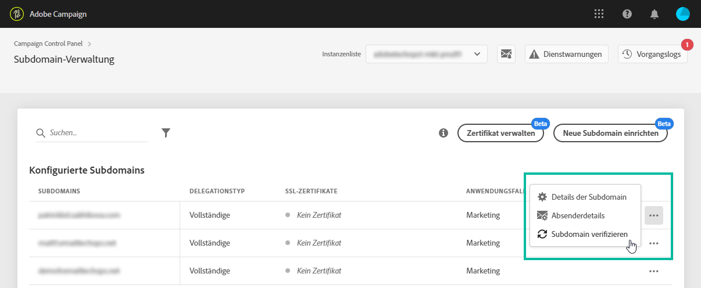

# Überwachen Ihrer Subdomains {#monitoring-subdomains}

Sie müssen Ihre Subdomains unbedingt überwachen, um sicherzustellen, dass alle ordnungsgemäß für die Verwendung mit Adobe Campaign konfiguriert sind.

Die Liste der Subdomains für jede Ihrer Produktionsinstanzen ist direkt verfügbar, wenn Sie die Karte **[!UICONTROL Subdomains &amp; Zertifikate]** auswählen.

Die Spalte **[!UICONTROL Letzte Verifizierung]** gibt an, wann eine Subdomain zum letzten Mal verifiziert wurde. Sie können eine Verifizierung jederzeit starten, indem Sie die Schaltfläche **...** / **[!UICONTROL Subdomain verifizieren]** auswählen.

>[!IMPORTANT]
>
>Adobe rät von der Verwendung von Subdomains ohne Zertifikatsdatum ab, da diese Subdomains Probleme mit der Zustellbarkeit haben können.

Beim Starten einer Verifizierung werden mehrere Vorgänge ausgeführt, um zu überprüfen, ob die Subdomain korrekt konfiguriert ist (Prüfung des Instanzmandanten, E-Mail-Versand-Test usw.). Wenn die Verifizierung der Subdomain fehlschlägt, wenden Sie sich an die Adobe-Kundenunterstützung, damit das Problem weiter analysiert werden kann.

**Verwandte Themen:**

* [Verlängern des SSL-Zertifikats einer Subdomain](../../subdomains-certificates/using/renewing-subdomain-certificate.md)
* [Subdomain-Branding](../../subdomains-certificates/using/subdomains-branding.md)
