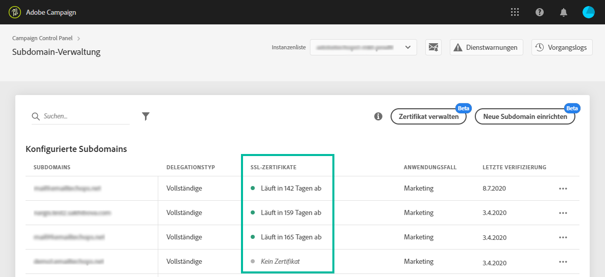

# Unterdomänen überwachen {#monitoring-subdomains}

Sie müssen Ihre Subdomänen unbedingt überwachen, um sicherzustellen, dass alle ordnungsgemäß für die Verwendung mit Adobe Campaign konfiguriert sind.

The list of subdomains for each of your production instances is accessible directly when selecting the **[!UICONTROL Subdomains &amp; Certificates]**card.

In der Liste der Subdomänen wird in der Spalte **[!UICONTROL Letzte Überprüfung]**angegeben, wann eine Subdomäne zum letzten Mal überprüft wurde.** Sie können eine Überprüfung jederzeit starten, indem Sie auf **... /**[!UICONTROL  Subdomain]** -Schaltfläche überprüfen.

>[!CAUTION]
>
>Adobe empfiehlt die Verwendung von Subdomänen ohne Überprüfungsdatum nicht, da dies bedeuten könnte, dass diese Subdomänen möglicherweise Probleme mit der Bereitstellung haben.

Beim Starten einer Überprüfung werden verschiedene Vorgänge ausgeführt, um zu überprüfen, ob die Subdomäne korrekt konfiguriert ist (Prüfung des Instanzenanwärters, E-Mail-Versand-Test usw.)

Wenn die Überprüfung der Subdomäne fehlschlägt, wenden Sie sich an den Adobe-Kundendienst, um weitere Informationen zu erhalten.
