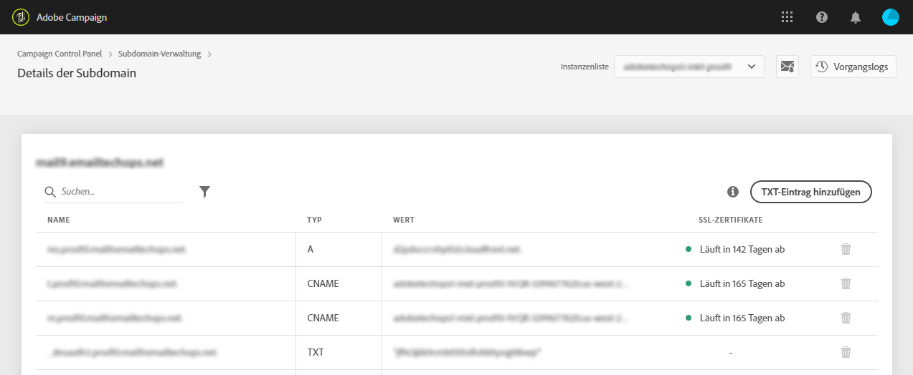

# Unterdomänen überwachen {#monitoring-subdomains}

Sie müssen Ihre Subdomänen unbedingt überwachen, um sicherzustellen, dass alle ordnungsgemäß für die Verwendung mit Adobe Campaign konfiguriert sind.

The list of subdomains for each of your production instances is accessible directly when selecting the **[!UICONTROL Subdomains &amp; Certificates]**card.

To get more details on a subdomain, click the **[!UICONTROL Subdomain Details]**button.
Die Liste aller verwandten Subdomänen wird angezeigt. Normalerweise sind dies Subdomains von Landingpages, Seiten mit Ressourcen usw.

Die Registerkarte &quot; **[!UICONTROL Sender-Info]**&quot;enthält Informationen zu den konfigurierten Postfächern (Sender, Antwort auf, Fehler-E-Mail).

In der Liste der Subdomänen wird in der Spalte **[!UICONTROL Letzte Überprüfung]**angegeben, wann eine Subdomäne zum letzten Mal überprüft wurde.** Sie können eine Überprüfung jederzeit starten, indem Sie auf **... /**[!UICONTROL  Subdomain]** -Schaltfläche überprüfen.

>[!CAUTION]
>
>Adobe empfiehlt die Verwendung von Subdomänen ohne Überprüfungsdatum nicht, da dies bedeuten könnte, dass diese Subdomänen möglicherweise Probleme mit der Bereitstellung haben.

Beim Starten einer Überprüfung werden verschiedene Vorgänge ausgeführt, um zu überprüfen, ob die Subdomäne richtig konfiguriert ist:

1. Die Systemsteuerung prüft, ob die Subdomäne zum Instanzmieter gehört.
1. Eine E-Mail wird von der Instanz mit dieser Subdomäne an eine Reihe von Testempfängern von &quot;250ok&quot;(eine E-Mail-Analyse- und Bereitstellungsplattform eines Drittanbieters) gesendet.
1. Nach Erhalt der E-Mail liest 250ok die E-Mail-Kopfzeilen und prüft, ob SPF und DKIM eingerichtet und gültig sind.
1. Die Systemsteuerung fragt den Zustellungsstatus von 250ok für ca. 20 Minuten kontinuierlich ab. Wenn SPF und DKIM weitergegeben werden, bedeutet dies, dass die angeforderte Subdomäne überprüft und vollständig konfiguriert ist und für das Senden von E-Mails bereit ist.
