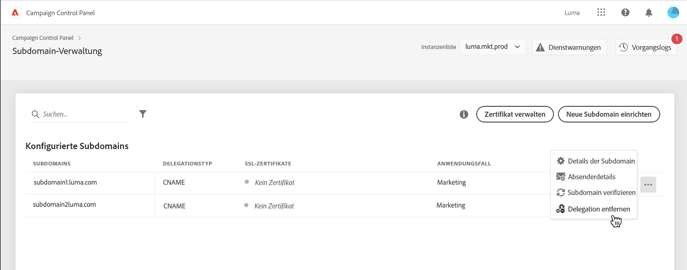
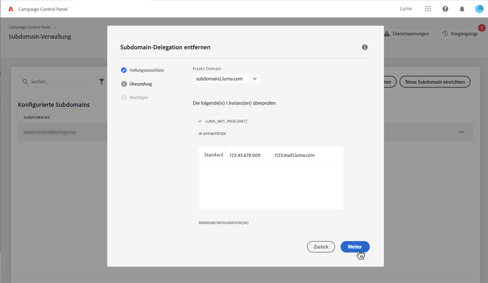
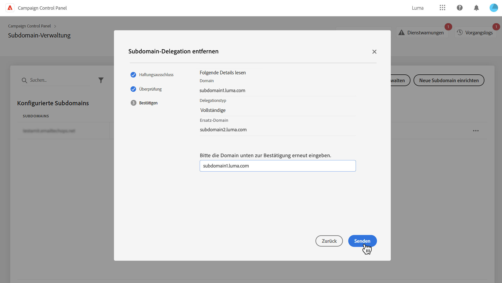
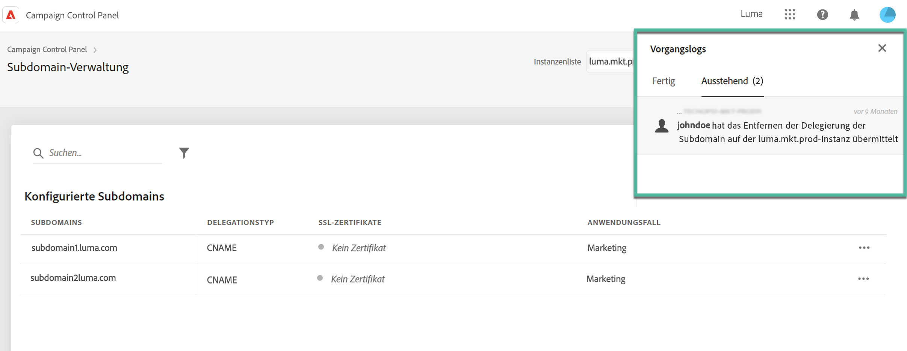
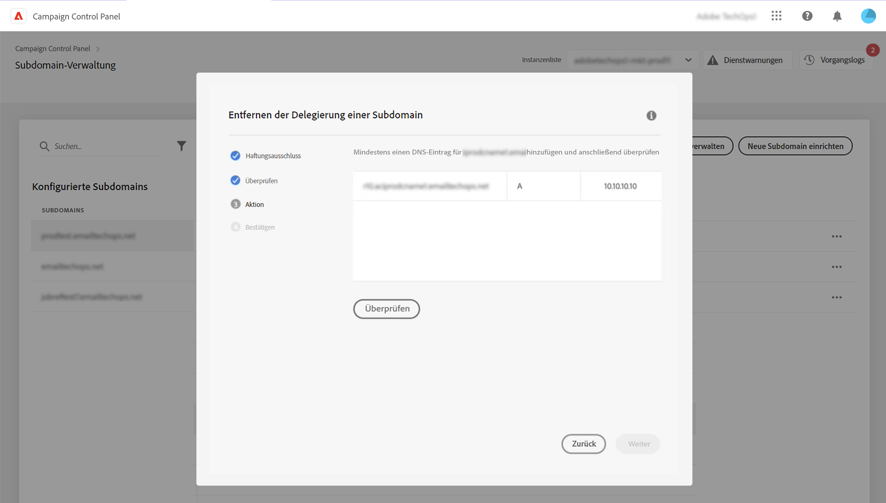

# Entfernen der Zuweisung von Subdomains an Adobe {#remove-delegated--subdomains}

>[!CONTEXTUALHELP]
>id="cp_subdomain_undelegate"
>title="Entfernen der Delegierung einer Subdomain"
>abstract="Auf diesem Bildschirm können Sie die Zuweisung einer Subdomain an Adobe entfernen. Es ist zu beachten, dass dieser Prozess nicht rückgängig gemacht werden kann und unumkehrbar ist, sobald die Ausführung begonnen hat.  Wenn Sie versuchen, die Zuweisung der primären Domain für die ausgewählte Instanz zu entfernen, müssen Sie die Domain angeben, der sie stattdessen zugewiesen werden soll."

Mit dem Control Panel können Sie die Zuweisung einer Subdomain entfernen, die vollständig mit CNAMEs an Adobe delegiert oder delegiert wurde.

## Wichtige Hinweise {#important}

Bevor Sie fortfahren, sollten Sie sorgfältig prüfen, welche Auswirkungen das Entfernen der Zuweisung haben könnte:

* Sobald der Prozess einmal ausgelöst wurde, kann das Entfernen der Subdomain-Zuweisung nicht mehr rückgängig gemacht werden und bleibt bis zum Abschluss des Prozesses unumkehrbar.
* Es kann keine andere Subdomain-Zuweisung entfernt werden, während ein ähnlicher Vorgang für eine andere Subdomain ausgeführt wird.
* Eine Subdomain, deren Delegation entfernt wurde, kann erst 3 Tage nach der Entfernung erneut delegiert werden.

## Entfernen der Zuweisung einer Subdomain {#steps}

Gehen Sie wie folgt vor, um die Zuweisung einer Subdomain zu Adobe zu entfernen:

1. Klicken Sie neben der Domain, die Sie entfernen möchten, auf die Schaltfläche mit den Auslassungspunkten und wählen Sie **[!UICONTROL Delegierte Subdomain entfernen]** aus.

   

1. Lesen Sie den Haftungsausschluss und bestätigen Sie die Entfernung der Domain-Zuweisung an Adobe.

1. Überprüfen Sie die Informationen zur Instanz, mit der die Subdomain verknüpft ist, einschließlich der zugehörigen IP-Affinitäten und Markenkonfigurationen.

   Wenn Sie die Zuweisung der primären Domain für die ausgewählte Instanz entfernen, müssen Sie mithilfe der Liste **[!UICONTROL Ersetzungs-Domain]** die Domain auswählen, die Sie stattdessen zuweisen.

   Klicken Sie auf **[!UICONTROL Weiter]**, um mit der Entfernung fortzufahren.

   

1. Wenn Sie eine Delegation vom Typ CNAME entfernen oder eine primäre Domäne durch eine mit CNAMEs delegierte Domäne ersetzen, wird eine zusätzliche **[!UICONTROL Aktion]** -Schritt angezeigt, um DNS-Einträge zu verwalten. [Weitere Informationen finden Sie in diesem Abschnitt](#dns)

1. Lesen Sie die angezeigte Zusammenfassung. Um die Entfernung zu bestätigen, geben Sie die URL der Domain ein, für die Sie die Zuweisung entfernen möchten, und klicken Sie auf **[!UICONTROL Senden]**.

   

Nachdem der Entfernungsprozess gestartet wurde, wird der ausstehende Vorgang in den Vorgangslogs angezeigt, bis er abgeschlossen ist.

## Verwaltung von DNS-Einträgen {#dns}

Um eine Domänendelegierung mit CNAMEs zu konfigurieren, muss das Control Panel bestimmte Einträge auf Ihrem DNS-Server hinzufügen. [Erfahren Sie, wie Sie Subdomains mit CNAMEs einrichten.](setting-up-new-subdomain.md#use-cnames)

Beim Entfernen einer CNAME-Delegation müssen Sie **DNS-Einträge entfernen** von Ihrem Server aus, um Probleme zu vermeiden. Wenn Sie außerdem die Zuweisung einer primären Subdomain entfernen und sie durch eine mit CNAME delegierte Domäne ersetzen möchten, müssen Sie möglicherweise **DNS-Einträge hinzufügen** auf Ihrem Server, abhängig von den für die Subdomain festgelegten IP-Affinitäten.

In der folgenden Tabelle sind die Aktionen aufgeführt, die je nach Art der Delegation, die Sie entfernen, und der Art der Zuweisung, die zum Einrichten der Ersatzdomäne verwendet wird.

| Delegation entfernt | Zuweisung von Ersatzdomänen | Erforderliche Aktion |
|  ---  |  ---  |  ---  |
| CNAME | Keine Ersatzdomäne | DNS-Einträge löschen |
| CNAME | CNAME | DNS-Einträge löschen DNS-Einträge hinzufügen *(optional, je nach IP-Affinitäten)* |
| CNAME | Vollständig | DNS-Einträge löschen |
| Vollständig | Keine Ersatzdomäne | Keine Aktion erforderlich |
| Vollständig | CNAME | DNS-Einträge hinzufügen *(optional, je nach IP-Affinitäten)* |
| Vollständig | Vollständig | Keine Aktion erforderlich |

{style="table-layout:auto"}

Dazu wird eine zusätzliche **[!DNL Action]** vor der Bestätigung des Delegationslöschens angezeigt. Dieser Bildschirm listet die DNS-Einträge auf, die je nach Kontext entfernt oder hinzugefügt werden sollen.

### DNS-Einträge löschen

1. Navigieren Sie zu Ihrem DNS-Server und entfernen Sie die im Control Panel aufgelisteten Datensätze.
1. Gehen Sie zurück zum Control Panel und klicken Sie auf **[!UICONTROL Nächste]** , um mit der Entfernung der Delegation fortzufahren.

### DNS-Einträge hinzufügen

1. Navigieren Sie zu Ihrem DNS-Server und fügen Sie die im Control Panel aufgelisteten Datensätze hinzu.
1. Warten Sie, bis der DNS-Zusatz wirksam ist.
1. Gehen Sie zurück zum Control Panel und klicken Sie auf **[!UICONTROL Überprüfen]**.
1. Nachdem das Hinzufügen der Datensätze erfolgreich überprüft wurde, klicken Sie auf **[!UICONTROL Nächste]** , um mit der Entfernung der Delegation fortzufahren.

## Fehler-Codes {#FAQ}

In diesem Abschnitt sind die Fehlermeldungen aufgelistet, die auftreten können, wenn Sie versuchen, die Zuweisung einer Subdomain zu entfernen:

| Fehler-Code | Nachricht | Beschreibung |
|  ---  |  ---  |  ---  |
| 8002 | Die angeforderte Entfernung der delegierten Domain kann nicht angegangen werden, da eine ähnliche, sich damit überlappende Anfrage ausgeführt wird. Bitte in 3 Tagen erneut versuchen | Ein Vorgang zum Entfernen einer Subdomain-Zuweisung wird für die ausgewählte Instanz bereits ausgeführt. Es muss 3 Tage gewartet werden, um einen neuen Entfernungsvorgang zu starten. |
| 8003 | Die angeforderte Entfernung der delegierten Domain wird für diese Instanz nicht unterstützt. | Aufgrund eines technischen Problems wird das Entfernen der Zuweisung für die ausgewählte Subdomain nicht unterstützt. Bitte die Kundenunterstützung kontaktieren. |
| 8004 | Die angeforderte Entfernung der delegierten Domain ist nicht zulässig, da es in dieser Instanz nur eine Domain gibt. | Für die ausgewählte Instanz wurde nur eine Subdomain delegiert. Das Entfernen von Zuweisungen ist nicht erlaubt. |
| 8005 | Die angeforderte Entfernung der delegierten Domain wird für diese Konfiguration nicht unterstützt. | Aufgrund eines technischen Problems wird das Entfernen der Zuweisung für die ausgewählte Subdomain nicht unterstützt. Bitte die Kundenunterstützung kontaktieren. |
| 8006 | Die angeforderte Entfernung der delegierten Domain ist aus unbekannten Gründen nicht zulässig. Bitte die Kundenunterstützung kontaktieren. | Aufgrund unbekannter Probleme wird das Entfernen von Zuweisungen für die ausgewählte Instanz nicht unterstützt. Bitte die Kundenunterstützung kontaktieren. |
