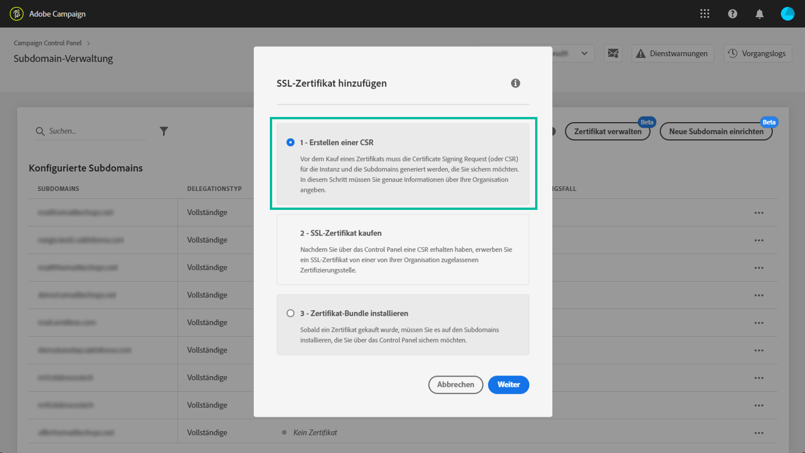

# Verlängern von SSL-Zertifikaten {#renewing-subdomains-ssl-certificates}

>[!CONTEXTUALHELP]
>id="cp_add_ssl_certificate"
>title="Verlängerung von SSL-Zertifikaten"
>abstract="Um ein SSL-Zertifikat hinzuzufügen, müssen Sie eine CSR generieren, das SSL-Zertifikat für Ihre Subdomain erwerben und das Zertifikat-Bundle installieren. Dieser Vorgang ist nur erforderlich, wenn Sie die Zertifikatsverwaltung manuell durchführen und nicht an Adobe delegieren möchten. "

>[!NOTE]
>
>Die Erneuerung der SSL-Zertifikate Ihrer Subdomains ist nur dann erforderlich, wenn Sie die Zertifikate selbst verwalten möchten, anstatt diesen Prozess an Adobe zu delegieren. Es wird dringend empfohlen, die Verwaltung der SSL-Zertifikate Ihrer Subdomains an Adobe zu delegieren, da Adobe das Zertifikat automatisch ausstellt und jedes Jahr vor Ablauf erneuert. [Erfahren Sie mehr über die Verwaltung von SSL-Zertifikaten](monitoring-ssl-certificates.md#management)

Der Verlängerungsprozess eines SSL-Zertifikats besteht aus drei Schritten:

1. **Erstellung der Certificate Signing Request (CSR)**

   Vor dem Kauf eines Zertifikats muss eine Certificate Signing Request für die Instanz und die Subdomains generiert werden, die Sie schützen möchten.  Dabei müssen Sie die zur Erstellung einer CSR erforderlichen Informationen bereitstellen (z. B. Gebrauchsname, Organisationsname und Adresse). [Weitere Informationen](#generate)

1. **Erwerb des SSL-Zertifikats**

   Sobald die CSR generiert wurde, können Sie damit das SSL-Zertifikat bei der von Ihrem Unternehmen genehmigten Zertifizierungsstelle erwerben.

1. **Installation des SSL-Zertifikats**

   Installieren Sie das erworbene SSL-Zertifikat auf der gewünschten Subdomain, um sie zu sichern. [Weitere Informationen](#install)

 Erkunden Sie diese Funktion von [Campaign v7/v8](https://experienceleague.adobe.com/docs/campaign-classic-learn/control-panel/subdomains-and-certificates/adding-ssl-certificates.html?lang=de#subdomains-and-certificates) oder [Campaign Standard](https://experienceleague.adobe.com/docs/campaign-standard-learn/control-panel/subdomains-and-certificates/adding-ssl-certificates.html?lang=de#adding-ssl-certificates) im Video.

**Verwandte Themen:**

* [Best Practice-Handbuch zur Zustellbarkeit – SSL-Zertifikats-Anforderungsprozess für Adobe Campaign](https://experienceleague.adobe.com/docs/deliverability-learn/deliverability-best-practice-guide/additional-resources/campaign/ac-ssl-certificate-request.html?lang=de)
* [Subdomain-Branding](../../subdomains-certificates/using/subdomains-branding.md)
* [Überwachen von Subdomains](../../subdomains-certificates/using/monitoring-subdomains.md)

## Generieren der CSR {#generate}

>[!CONTEXTUALHELP]
>id="cp_generate_csr"
>title="CSR-Generierung"
>abstract="Vor dem Kauf eines Zertifikats muss eine Certificate Signing Request für die Instanz und die Subdomains generiert werden, die Sie schützen möchten."

>[!CONTEXTUALHELP]
>id="cp_select_subdomains"
>title="Auswählen der Subdomains für Ihre CSR"
>abstract="Sie können auswählen, ob Sie alle oder nur bestimmte Subdomains in Ihre Certificate Signing Request aufnehmen möchten. Nur ausgewählte Subdomains werden über das erworbene SSL-Zertifikat zertifiziert."

Gehen Sie wie folgt vor, um eine Certificate Signing Request (CSR) zu erstellen:

1. Wählen Sie zuerst auf der Karte **[!UICONTROL Subdomains &amp; Zertifikate]** die gewünschte Instanz und danach **[!UICONTROL Zertifikat verwalten]** aus.

   

1. Wählen Sie **[!UICONTROL 1 - Erstellen einer CSR]** und dann **[!UICONTROL Weiter]** aus, um den Assistenten zu starten, der Sie durch den CSR-Generierungsprozess führt.

   

1. Daraufhin wird ein Formular mit allen Details angezeigt, die zum Generieren Ihrer CSR erforderlich sind.

   Vergewissern Sie sich, dass Sie die angeforderten Informationen vollständig und korrekt ausgefüllt haben. Anderenfalls kann das Zertifikat möglicherweise nicht verlängert werden. (Wenden Sie sich bei Bedarf an Ihr internes Team bzw. Ihr Sicherheits- oder IT-Team.) Wählen Sie dann **[!UICONTROL Weiter]** aus.

   * **[!UICONTROL Organisation]**: Offizieller Name der Organisation.
   * **[!UICONTROL Organisationseinheit]**: Die mit der Subdomain verknüpfte Einheit (Beispiel: Marketing, IT).
   * **[!UICONTROL Instanz]** (vorbelegt): URL der Campaign-Instanz, die mit der Subdomain verknüpft ist.
   * **[!UICONTROL Gebrauchsname]**: Wenn der Gebrauchsname standardmäßig ausgewählt ist, können Sie bei Bedarf eine der Subdomains auswählen.

   

1. Wählen Sie zuerst die Subdomains aus, die in die CSR einbezogen werden sollen, und danach **[!UICONTROL OK]**.

   

1. Die ausgewählten Subdomains werden in der Liste angezeigt. Wählen Sie für jede davon die einzubeziehenden Subdomains und dann **[!UICONTROL Weiter]** aus.

   

1. In einer Zusammenfassung werden alle Subdomains angezeigt, die in die CSR einbezogen werden sollen. Bestätigen Sie Ihre Anfrage durch die Auswahl von **[!UICONTROL Senden]**.

   

   >[!NOTE]
   >
   >Mit der Schaltfläche **[!UICONTROL CSR-Inhalt kopieren]** können Sie alle mit der CSR verbundenen Informationen kopieren (Org-ID, Instanz, Organisationsname, Gebrauchsname, enthaltene Subdomains usw.).

1. Die CSR-Datei wird entsprechend Ihrer Auswahl automatisch generiert und heruntergeladen. Mit dieser Datei können Sie nun das SSL-Zertifikat bei der von Ihrem Unternehmen genehmigten Zertifizierungsstelle erwerben. Wenn Sie die CSR erneut herunterladen müssen, befolgen Sie die in [diesem Abschnitt](#download) beschriebenen Schritte.

Sobald Ihre CSR erstellt und heruntergeladen wurde, können Sie damit ein SSL-Zertifikat bei einer von Ihrer Organisation genehmigten Zertifizierungsstelle erwerben.

Nachdem Sie das SSL-Zertifikat erworben haben, können Sie es in Ihrer Instanz installieren, um Ihre Subdomain zu sichern. [Weitere Informationen](#install)

## CSR herunterladen {#download}

Um ein SSL-Zertifikat zu erwerben, müssen Sie zunächst den „Certificate Signing Request“ herunterladen. Die CSR wird automatisch heruntergeladen, nachdem sie generiert wurde. Sie können ihn auch jederzeit in den Vorgangslogs erneut herunterladen:

1. Wählen Sie in den **[!UICONTROL Vorgangslogs]** die Registerkarte **[!UICONTROL Abgeschlossen]** und filtern Sie dann die Liste, um Vorgänge im Zusammenhang mit der Verwaltung von Subdomains anzuzeigen.

   

1. Öffnen Sie den Vorgang, der der Generierung der CSR entspricht, und klicken Sie dann auf den **[!UICONTROL Downbload]**-Link, um die CSR-Datei zu erhalten.

   

## Installieren des SSL-Zertifikats {#install}

>[!CONTEXTUALHELP]
>id="cp_install_ssl_certificate"
>title="Installation eines SSL-Zertifikats"
>abstract="Installieren Sie das SSL-Zertifikat, das Sie bei der von Ihrem Unternehmen zugelassenen Zertifizierungsstelle erworben haben."

Sobald Sie ein SSL-Zertifikat gekauft haben, können Sie es auf Ihrer Instanz installieren. Bevor Sie fortfahren, achten Sie auf folgende Voraussetzungen:

* Die Certificate Signing Request (CSR) muss über das Control Panel generiert worden sein. Andernfalls können Sie das Zertifikat nicht über das Control Panel installieren.
* Die Certificate Signing Request (CSR) sollte mit der Subdomain übereinstimmen, die für die Verwendung mit Adobe konfiguriert wurde. Sie kann beispielsweise nicht mehr Subdomains enthalten als die konfigurierte.
* Das Datum des Zertifikats muss aktuell sein. Es ist nicht möglich, Zertifikate mit einem Datum in der Zukunft zu installieren. Zertifikate dürfen nicht abgelaufen sein (d. h. gültiges Start- und Enddatum).
* Das Zertifikat muss von einer vertrauenswürdigen Zertifizierungsstelle (CA) wie Comodo, DigiCert, GoDaddy usw. ausgestellt sein.
* Die Größe des Zertifikats darf maximal 2048 Bit betragen und der Algorithmus muss vom Typ RSA sein.
* Das Zertifikat muss im X.509 PEM-Format vorliegen.
* SAN-Zertifikate werden unterstützt.
* Wildcard-Zertifikate werden nicht unterstützt.
* Die ZIP-Datei bzw. das Zertifikat darf nicht passwortgeschützt sein.
* Die ZIP-Datei darf – möglichst in einzelnen Dateien – nur Folgendes enthalten:
   * End-Entity-Zertifikat.
   * Intermediate-Zertifikatskette (in der richtigen Reihenfolge angeordnet).
   * Root-Zertifikat (optional).

Gehen Sie wie folgt vor, um das Zertifikat zu installieren:

1. Wählen Sie zuerst auf der Karte **[!UICONTROL Subdomains &amp; Zertifikate]** die gewünschte Instanz und danach **[!UICONTROL Zertifikat verwalten]** aus.

   

1. Wählen Sie **[!UICONTROL 3 - Zertifikat-Bundle installieren]** und dann **[!UICONTROL Weiter]** aus, um den Assistenten zu starten, der Sie durch den Zertifikatinstallationsprozess führt.

   

1. Wählen Sie die .zip-Datei aus, die das zu installierende Zertifikat enthält, und wählen Sie danach **[!UICONTROL Senden]** aus.

   

>[!NOTE]
>
>Das Zertifikat wird in allen in der CSR enthaltenen Domains/Subdomains installiert. Zusätzliche Domains/Subdomains, die im Zertifikat vorhanden sind, werden nicht berücksichtigt.

Nach der Installation des SSL-Zertifikats werden das Gültigkeitsdatum und das Statussymbol des Zertifikats entsprechend aktualisiert.
