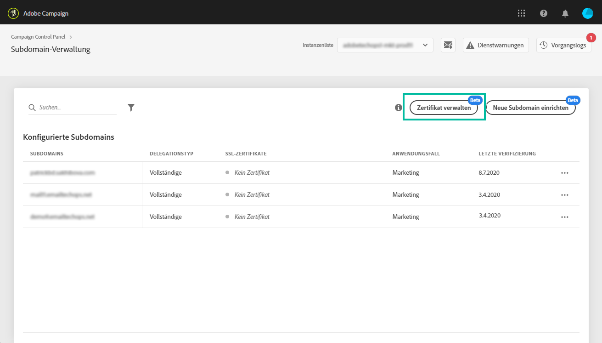
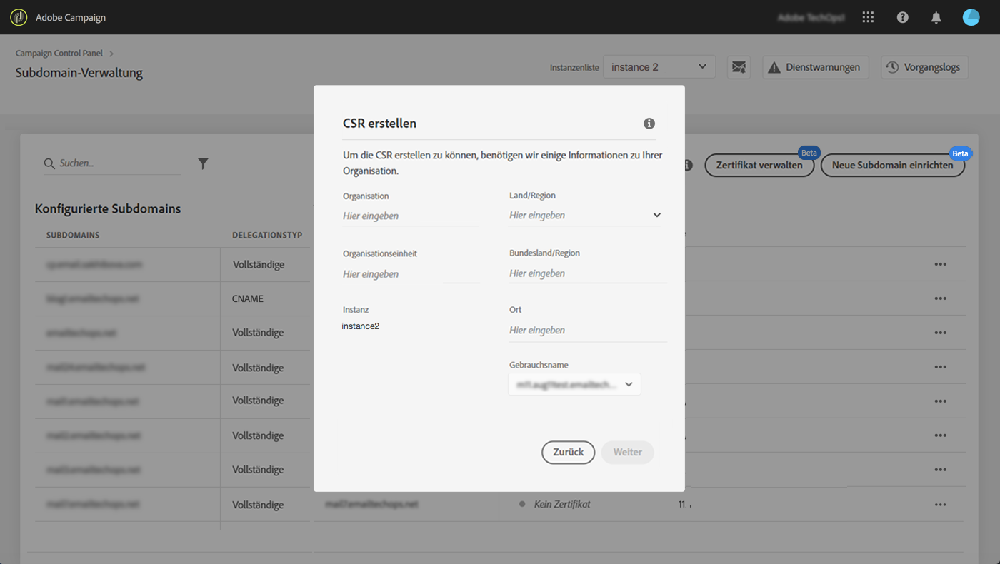

# Verlängerung des SSL-Zertifikats einer Subdomäne {#renewing-subdomains-ssl-certificates}

>[!NOTE]
>
>Die Subdomänenübertragung von der Systemsteuerung befindet sich derzeit in der Betaphase und unterliegt häufigen Aktualisierungen und Änderungen ohne Benachrichtigung.

## Grundlagen zur Zertifikatverlängerung {#about-certificate-renewal-process}

Der Verlängerungsprozess eines SSL-Zertifikats besteht aus drei Schritten:

1. **Generierung der Zertifikatsignaturanforderung (CSR)** Der Adobe-Kundendienst generiert eine CSR für Sie. Darauf müssen Sie alle für die Erstellung einer CSR erforderlichen Informationen bereitstellen (z. B. Gebrauchsname, Organisationsname und Adresse). 
1. **Erwerb des SSL-Zertifikats** Sobald das CSR generiert wurde, können Sie es herunterladen und zum Kauf des SSL-Zertifikats bei der Zertifizierungsstelle verwenden, die Ihr Unternehmen genehmigt.
1. **Installation des SSL-Zertifikats** Nachdem Sie das SSL-Zertifikat erworben haben, können Sie es in der gewünschten Subdomäne installieren.

>[!NOTE]
>
>Die Erneuerung von SSL-Zertifikaten über die Systemsteuerung ist nur für **vollständig delegierte Subdomänen** verfügbar.

## Erstellen einer Zertifikatsignaturanforderung (CSR) {#generating-csr}

Gehen Sie wie folgt vor, um eine CSR-Anforderung (Certificate Signing Request) zu erstellen:

1. Wählen Sie auf der Karte &quot; **[!UICONTROL Subdomänen und Zertifikate]**&quot;die gewünschte Instanz aus und klicken Sie dann auf die Schaltfläche &quot;Zertifikat**[!UICONTROL  verwalten&quot;]** .

   

1. Wählen Sie &quot;CSR **[!UICONTROL generieren&quot;]**und klicken Sie dann auf &quot;**[!UICONTROL  Weiter]** &quot;, um den Assistenten zu starten, der Sie durch den CSR-Generierungsprozess führt.

   

1. Es wird ein Formular mit allen zum Generieren der CSR erforderlichen Details angezeigt.

   Vergewissern Sie sich, dass Sie die angeforderten Informationen vollständig und genau ausfüllen. Andernfalls wird das Zertifikat möglicherweise nicht erneuert (wenden Sie sich bei Bedarf an Ihr internes Team, Ihre Sicherheits- und IT-Teams), und klicken Sie auf **[!UICONTROL Weiter]**.

   * **[!UICONTROL Einrichtung]**: Name der amtlichen Einrichtung.
   * **[!UICONTROL Referat]**Einrichtung: mit der Subdomäne verknüpfte Einheit (Beispiel: Marketing, IT).
   * **[!UICONTROL Instanz]**(vorausgefüllt): URL der der Subdomäne zugeordneten Kampagneninstanz.
   

1. Wählen Sie die Subdomänen aus, die in die CSR einbezogen werden sollen, und klicken Sie dann auf **[!UICONTROL OK]**.

   

1. Die ausgewählten Subdomänen werden in der Liste angezeigt. Wählen Sie für jede dieser Domänen die einzuschließenden Subdomänen aus und klicken Sie dann auf **[!UICONTROL Weiter]**.

   

1. Es wird eine Zusammenfassung der Subdomänen angezeigt, die in das CSR einbezogen werden sollen. Klicken Sie auf **[!UICONTROL Senden]**, um Ihre Anforderung zu bestätigen.

   

1. Die CSR-Datei, die Ihrer Auswahl entspricht, wird automatisch generiert und heruntergeladen. Sie können es jetzt verwenden, um das SSL-Zertifikat von der Zertifizierungsstelle zu erwerben, die Ihr Unternehmen genehmigt.

## Erwerb eines Zertifikats mit dem CSR {#purchasing-certificate}

Nachdem Sie eine CSR-Anforderung für Zertifikatsignierung von der Systemsteuerung erhalten haben, erwerben Sie ein SSL-Zertifikat von einer Zertifizierungsstelle, die von Ihrem Unternehmen genehmigt wurde.

## SSL-Zertifikat installieren {#installing-ssl-certificate}

Nachdem Sie ein SSL-Zertifikat erworben haben, können Sie es auf Ihrer Instanz installieren. Bevor Sie fortfahren, stellen Sie sicher, dass Sie die folgenden Voraussetzungen kennen:

* Die Zertifikatsignaturanforderung (Certificate Signing Request, CSR) muss über die Systemsteuerung generiert worden sein. Andernfalls können Sie das Zertifikat nicht über die Systemsteuerung installieren.
* Stellen Sie sicher, dass die Anforderung zur Zertifikatsignierung (Certificate Signing Request, CSR) mit der Subdomäne übereinstimmt, die an Adobe delegiert wurde. Es kann beispielsweise nicht mehr Subdomänen enthalten, als die delegierte Domäne.
* Das Zertifikat muss ein aktuelles Datum haben. Es ist nicht möglich, Zertifikate mit Terminen in der Zukunft zu installieren.

Gehen Sie wie folgt vor, um das Zertifikat zu installieren:

1. Wählen Sie auf der Karte &quot; **[!UICONTROL Subdomänen und Zertifikate]**&quot;die gewünschte Instanz aus und klicken Sie dann auf die Schaltfläche &quot;Zertifikat**[!UICONTROL  verwalten&quot;]** .

   

1. Klicken Sie auf SSL-Zertifikat ****installieren und dann auf**[!UICONTROL  Weiter]** , um den Assistenten zu starten, der Sie durch den Zertifikatinstallationsprozess führt.

   

1. Wählen Sie die ZIP-Datei aus, die das zu installierende Zertifikat enthält, und klicken Sie dann auf **[!UICONTROL Senden]**.

   

Nach der Installation des SSL-Zertifikats werden das Ablaufdatum und das Statussymbol des Zertifikats entsprechend aktualisiert.

Die URL-Adresse Ihrer Subdomäne ändert sich von **http** in **https**.
