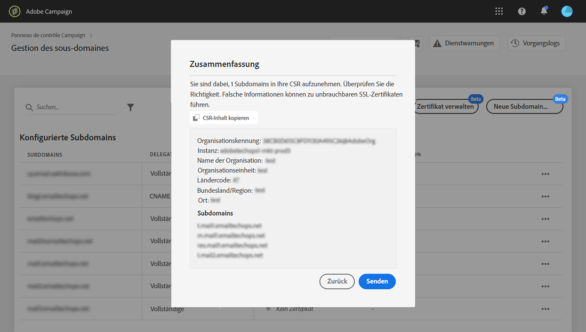
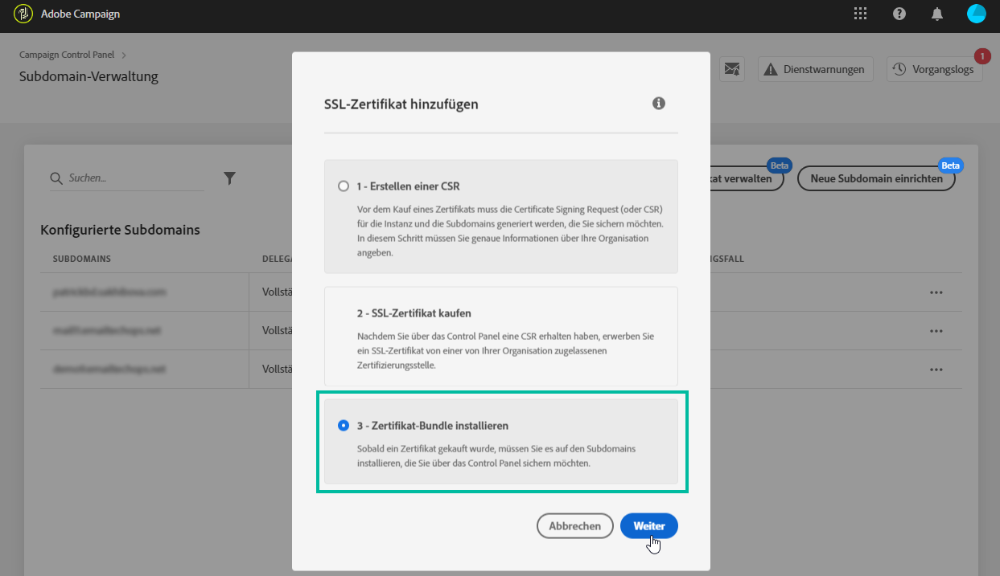

# Verlängerung des SSL-Zertifikats einer Subdomäne {#renewing-subdomains-ssl-certificates}

## Informationen zum Zertifikatverlängerungsprozess {#about-certificate-renewal-process}

Der SSL-Zertifikatverlängerungsprozess umfasst drei Schritte, die alle direkt über die Systemsteuerung ausgeführt werden:

1. **Generierung der Zertifikatsignaturanforderung (CSR)** Der Adobe-Kundendienst generiert eine CSR für Sie. Sie müssen einige Informationen angeben, die zum Generieren der CSR erforderlich sind (z. B. Allgemeiner Name, Name und Adresse des Unternehmens usw.).
1. **Erwerb des SSL-Zertifikats** Sobald das CSR generiert wurde, können Sie es herunterladen und zum Kauf des SSL-Zertifikats bei der Zertifizierungsstelle verwenden, die Ihr Unternehmen genehmigt.
1. **Installation des SSL-Zertifikats** Nachdem Sie das SSL-Zertifikat erworben haben, können Sie es in der gewünschten Subdomäne installieren.

### Erstellen einer Zertifikatsignaturanforderung (CSR) {#generating-csr}

Gehen Sie wie folgt vor, um eine CSR-Anforderung (Certificate Signing Request) zu erstellen:

1. Wählen Sie auf der Karte &quot; **[!UICONTROL Subdomänen und Zertifikate]**&quot;die gewünschte Instanz aus und klicken Sie dann auf die Schaltfläche &quot;Zertifikat**[!UICONTROL  verwalten&quot;]** .

   

1. Wählen Sie &quot;CSR **[!UICONTROL generieren&quot;]**und klicken Sie dann auf &quot;**[!UICONTROL  Weiter]** &quot;, um den Assistenten zu starten, der Sie durch den CSR-Generierungsprozess führt.

   

1. Es wird ein Formular mit allen zum Generieren der CSR erforderlichen Details angezeigt.

   Vergewissern Sie sich, dass Sie die angeforderten Informationen vollständig und genau ausfüllen (wenden Sie sich bei Bedarf an Ihr internes Team, Ihre Sicherheits- und IT-Teams) und klicken Sie auf **[!UICONTROL Weiter]**.

   * **[!UICONTROL Organisation]**:
   * **[!UICONTROL Organisationseinheit]**:
   * **[!UICONTROL Instanz]**: URL der der Subdomäne zugeordneten Kampagneninstanz.
   

1. Wählen Sie die Subdomänen aus, die in die CSR einbezogen werden sollen, und klicken Sie dann auf **[!UICONTROL OK]**.

   

1. Die ausgewählten Subdomänen werden in der Liste angezeigt. Wählen Sie für jede dieser Domänen die einzuschließenden Subdomänen aus und klicken Sie dann auf **[!UICONTROL Weiter]**.

   

1. Es wird eine Zusammenfassung der Subdomänen angezeigt, die in das CSR einbezogen werden sollen. Klicken Sie auf **[!UICONTROL Senden]**, um Ihre Anforderung zu bestätigen.

   

1. Die CSR-Datei, die Ihrer Auswahl entspricht, wird automatisch generiert und heruntergeladen. Sie können es jetzt verwenden, um das SSL-Zertifikat von der Zertifizierungsstelle zu erwerben, die Ihr Unternehmen genehmigt.

## Installieren eines SSL-Zertifikats {#installing-ssl-certificate}

Nachdem Sie ein SSL-Zertifikat erworben haben, führen Sie die folgenden Schritte aus, um es auf Ihrer Instanz zu installieren.

1. Wählen Sie auf der Karte &quot; **[!UICONTROL Subdomänen und Zertifikate]**&quot;die gewünschte Instanz aus und klicken Sie dann auf die Schaltfläche &quot;Zertifikat**[!UICONTROL  verwalten&quot;]** .

   

1. Klicken Sie auf SSL-Zertifikat ****installieren und dann auf**[!UICONTROL  Weiter]** , um den Assistenten zu starten, der Sie durch den Zertifikatinstallationsprozess führt.

   

1. Wählen Sie die ZIP-Datei aus, die das zu installierende Zertifikat enthält, und klicken Sie dann auf **[!UICONTROL Senden]**.

   
