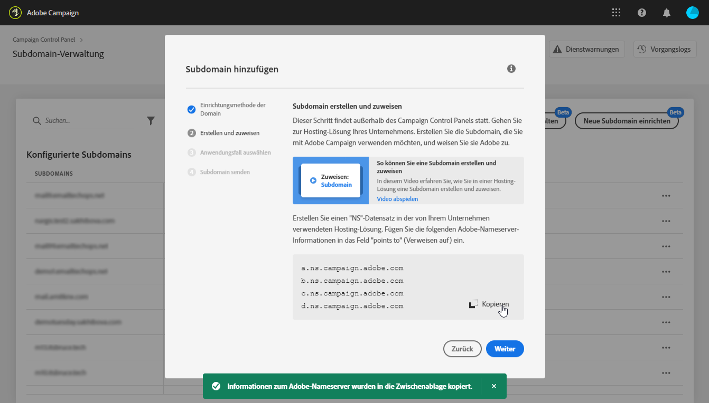

# Einrichten einer neuen Subdomäne {#setting-up-subdomain}

## Vollständige Subdomäne-Übertragung {#full-subdomain-delegation}

Über die Systemsteuerung können Sie eine Subdomäne vollständig an Adobe Campaign delegieren. Gehen Sie dazu wie folgt vor:

1. Wählen Sie auf der Karte &quot; **[!UICONTROL Subdomänen und Zertifikate]**&quot;die gewünschte Produktionsinstanz und klicken Sie dann auf Neue Subdomäne**[!UICONTROL  einrichten]**.

   >[!NOTE]
   >
   >Die Subdoman-Delegation ist nur für **Produktionsinstanzen** verfügbar.

   

1. Klicken Sie auf **[!UICONTROL Weiter]**, um die vollständige Delegationsmethode zu bestätigen.

   >[!NOTE]
   >
   >[CNAME](#use-cnames) und benutzerdefinierte Methoden werden derzeit nicht von der Systemsteuerung unterstützt.

   

1. Erstellen Sie die gewünschte Subdomäne und Nameserver in der von Ihrem Unternehmen verwendeten Hostinglösung. Kopieren Sie dazu die im Assistenten angezeigten Adobe Nameserver-Informationen und fügen Sie sie ein.

   Weitere Informationen zum Erstellen einer Subdomäne in einer Hostinglösung finden Sie in diesem Video.

   

   Nachdem die Subdomäne mit den entsprechenden Adobe-Serverinformationen erstellt wurde, klicken Sie auf **[!UICONTROL Weiter]**.

1. Wählen Sie die gewünschte Verwendungsart für die Subdomäne aus:

   * **Marketingkommunikation**: für kommerzielle Zwecke bestimmte Mitteilungen. Beispiel: Vertriebs-E-Mail-Kampagne.
   * **Transaktions- und Betriebskommunikation**: Transaktionskommunikation enthält Informationen zum Abschluss eines Prozesses, den der Empfänger mit Ihnen gestartet hat. Beispiel: Kaufbestätigung, E-Mail zum Zurücksetzen des Kennworts. Organisatorische Kommunikation bezieht sich auf den Austausch von Informationen, Ideen und Ansichten innerhalb und außerhalb der Organisation ohne kommerziellen Zweck.
   >[!NOTE]
   >
   >Die Unterteilung Ihrer Subdomänen nach Anwendungsfällen ist eine Best Practice für die Bereitstellung. Dadurch wird der Ruf jeder Subdomäne isoliert und geschützt.
   >
   >Wenn Ihre Subdomäne für Marketingkommunikation beispielsweise letztendlich von Internet Service Providern auf die schwarze Liste gesetzt wird, wird Ihre Subdomäne für Transaktionskommunikation nicht beeinträchtigt und kann weiterhin Nachrichten senden.

   

1. Geben Sie die von Ihnen erstellte Subdomäne in Ihre Hostinglösung ein und klicken Sie dann auf **[!UICONTROL Senden]**.

   >[!NOTE]
   >
   > Vergewissern Sie sich, dass Sie den **vollständigen Namen** der zu delegierenden Subdomäne eingeben. Um beispielsweise die Subdomäne &quot;usoffer.email.weretail.com&quot;zu delegieren, geben Sie &quot;usoffer.email.weretail.com&quot;ein.

   

1. Sobald die Subdomäne übermittelt wurde, prüft die Systemsteuerung, ob sie korrekt auf Adobe NS-Datensätze verweist und ob der SOA-Datensatz (Start of Authority) für diese Subdomäne nicht vorhanden ist.

1. Wenn die Prüfungen erfolgreich sind, beginnt die Systemsteuerung mit der Einrichtung der Subdomäne mit DNS-Datensätzen, zusätzlichen URLs, Postfächern usw. Weitere Informationen zum Konfigurationsstatus erhalten Sie, wenn Sie auf die Schaltfläche **[!UICONTROL Prozessdetails]**klicken.

   

Am Ende des Prozesses werden die Subdomänen für die Verwendung mit Ihrer Adobe Campaign-Instanz konfiguriert und die folgenden Elemente werden erstellt:

* **Die Subdomäne** mit den folgenden **DNS-Datensätzen**: SOA, MX, CNAME(s), DKIM, SPF, TXT,
* **Zusätzliche Subdomänen** zum Hosten von Mirror, Ressource, Verfolgungsseiten und domainkey,
* **Postfächer**: Sender, Fehler, Antwort.

## Verwendung von CNAMEs {#use-cnames}

Die Verwendung von CNAMEs für die Übertragung von Subdomänen wird von Adobe nicht empfohlen und wird nicht über die Systemsteuerung unterstützt.

Wenden Sie sich zur Verwendung dieser Methode an den Adobe-Kundendienst.
