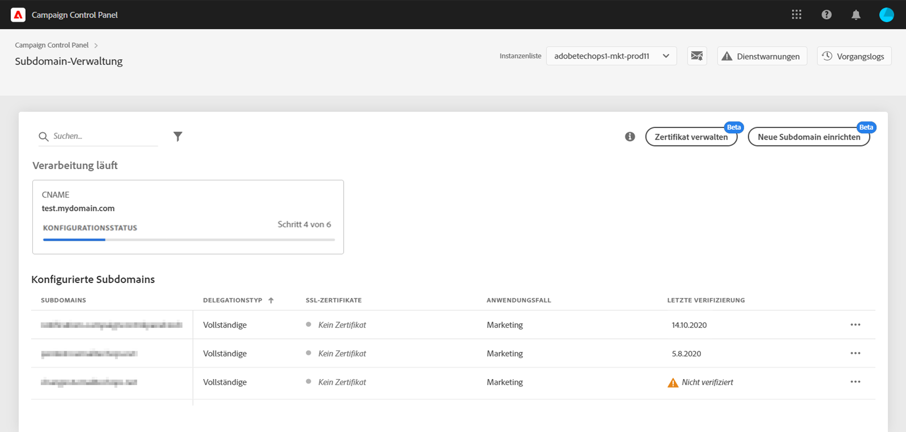

# Einrichten einer neuen Subdomain {#setting-up-subdomain}

>[!IMPORTANT]
>
>Die Subdomain-Zuweisung über das Control Panel wird Ende Januar als Beta-Version verfügbar sein und häufigen Aktualisierungen und Änderungen ohne vorherige Ankündigung unterliegen.

Wenden Sie sich bei Fragen zu Subdomänendelegationsmethoden an das Adobe-Bereitstellungsteam oder wenden Sie sich an den Kundendienst, um Beratung zur Lieferbarkeit anzufordern.

## Vollständige Subdomain-Zuweisung {#full-subdomain-delegation}

Über das Control Panel können Sie Adobe Campaign eine Subdomain vollständig zuweisen. Gehen Sie dazu wie folgt vor:

>[!NOTE]
>
>Wenn die ausgewählte Instanz keine zuvor konfigurierten Subdomains hat, wird die erste Subdomain, die Adobe zugewiesen wird, zur **primären Subdomain** für diese Instanz. Sie werden dies später nicht mehr ändern können.
>
>Mithilfe dieser primären Subdomain werden Reverse-DNS-Einträge für andere Subdomains erstellt. Außerdem werden über die primäre Subdomain Antwort- und Bounce-Adressen für andere Subdomains generiert.

1. Wählen Sie auf der Karte **[!UICONTROL Subdomains &amp; Zertifikate]**die gewünschte Produktionsinstanz und danach**[!UICONTROL  Neue Subdomain einrichten]** aus.

   

   >[!NOTE]
   >
   >Die Zuweisung von Subdomains ist nur für **Produktionsinstanzen** verfügbar.

1. Wählen Sie **[!UICONTROL Weiter]**aus, um die Methode der vollständigen Zuweisung zu bestätigen.

   

   >[!NOTE]
   >
   >[CNAME](#use-cnames) und benutzerdefinierte Methoden werden derzeit vom Control Panel nicht unterstützt.

1. Erstellen Sie die gewünschte Subdomain und die gewünschten Nameserver in der von Ihrem Unternehmen verwendeten Hosting-Lösung. Kopieren Sie dazu die im Assistenten angezeigten Adobe-Nameserver-Informationen und fügen Sie sie ein. Weitere Informationen zum Erstellen einer Subdomain in einer Hosting-Lösung finden Sie in diesem [Tutorial-Video](https://video.tv.adobe.com/v/30175?captions=ger).

   >[!CAUTION]
   >
   >Achten Sie beim Konfigurieren von Nameservern darauf, **Adobe nie Ihre Stamm-Subdomain zuzuweisen**. Andernfalls kann die Domain nur mit Adobe verwendet werden. Eine andere Verwendung ist dann nicht möglich, wie z. B. das Senden interner E-Mails an die Mitarbeiter Ihrer Organisation.

   

   Nachdem die Subdomain mit den entsprechenden Adobe-Nameserver-Informationen erstellt wurde, wählen Sie **[!UICONTROL Weiter]**aus.

1. Wählen Sie den gewünschten Anwendungsfall für die Subdomain aus:

   * **Marketingnachrichten**: für kommerzielle Zwecke bestimmte Mitteilungen. Beispiel: Vertriebs-E-Mail-Kampagne.
   * **Transaktions- und Betriebsnachrichten**: Transaktionsnachrichten enthalten Informationen zum Abschluss eines Prozesses, den der Empfänger mit Ihnen gestartet hat. Beispiel: Kaufbestätigung, E-Mail zum Zurücksetzen des Passworts. Betriebliche Nachrichten beziehen sich auf den Austausch von Informationen, Ideen und Ansichten innerhalb und außerhalb der Organisation ohne kommerziellen Zweck.
   >[!NOTE]
   >
   >Die Unterteilung Ihrer Subdomains nach Anwendungsfällen ist eine Best Practice für die Zustellbarkeit. Dadurch wird die Reputation jeder Subdomain isoliert und geschützt.
   >
   >Wenn Ihre Subdomain für Marketingnachrichten beispielsweise von Internetdienstanbietern auf die Blacklist gesetzt wird, wird Ihre Subdomain für Transaktionsnachrichten nicht beeinträchtigt und kann weiterhin Nachrichten senden.

   

1. Geben Sie die von Ihnen erstellte Subdomain in Ihre Hosting-Lösung ein und wählen Sie dann **[!UICONTROL Senden]**aus.

   >[!NOTE]
   >
   > Vergewissern Sie sich, dass Sie den **vollständigen Namen** der zuzuweisenden Subdomain eingeben. Um beispielsweise die Subdomain &quot;usoffer.email.weretail.com&quot; zuzuweisen, geben Sie &quot;usoffer.email.weretail.com&quot; ein.

   

1. Nachdem die Subdomain übermittelt wurde, prüft das Control Panel, ob sie korrekt auf Adobe-NS-Einträge verweist. Zusätzlich wird sichergestellt, dass für diese Subdomain kein SOA-Datensatz (Start of Authority) existiert.

1. Wenn die Prüfungen erfolgreich sind, beginnt das Control Panel mit der Einrichtung der Subdomain mit DNS-Einträgen, zusätzlichen URLs, Postfächern usw. Wählen Sie **[!UICONTROL Prozessdetails]**aus, um weitere Informationen zum Konfigurationsfortschritt zu erhalten.

   

   >[!NOTE]
   >
   >In einigen Fällen wird die Zuweisung durchgeführt, die Subdomain wird jedoch möglicherweise nicht erfolgreich verifiziert. Die Subdomain wird direkt in die Liste der **[!UICONTROL verifizierten Subdomain]**mit dem Status**[!UICONTROL  Nicht verifiziert]** und einem Verarbeitungslog mit Informationen zum Fehler aufgenommen. Wenden Sie sich an die Kundenunterstützung, wenn Sie Probleme bei der Lösung des Problems haben.
   >
   >Beachten Sie, dass während der Ausführung der Subdomain-Zuweisung andere Anfragen über das Control Panel in eine Warteschlange eingegeben und erst nach Abschluss der Subdomain-Zuweisung ausgeführt werden, um Leistungsprobleme zu vermeiden.

Am Ende des Prozesses werden die Subdomains für die Verwendung mit Ihrer Adobe Campaign-Instanz konfiguriert und die folgenden Elemente erstellt:

* **Die Subdomain** mit den folgenden **DNS-Einträgen**: SOA, MX, CNAME(s), DKIM, SPF, TXT,
* **Zusätzliche Subdomains** zum Hosten von Mirror-, Ressourcen- und Tracking-Seiten sowie von Domain-Schlüsseln,
* **Postfächer**: Absender, Fehler, Antwort.

>[!NOTE]
>
>Standardmäßig ist das „Antwort“-Postfach über das Control Panel so konfiguriert, dass E-Mails gelöscht werden, und kann nicht überprüft werden. Verwenden Sie diese Adresse nicht, wenn Sie Ihr „Antwort“-Postfach für Ihre Marketingkampagnen überwachen möchten.

Klicken Sie auf **[!UICONTROL Details der Subdomain]**, um weitere Details zur Subdomain zu erhalten.

>[!NOTE]
>
>Zusätzlich zur Verarbeitungsphase benachrichtigt Adobe das Zustellbarkeitsteam über die neu erstellte Subdomain, um sie zu überprüfen. Der Prüfvorgang kann bis zu 3 Tage dauern, nachdem die Subdomain zugewiesen wurde.
>
>Die durchgeführten Überprüfungen umfassen das Testen von Feedback-Schleifen und Spam-Beschwerdeschleifen. Daher empfehlen wir nicht, die Subdomain vor Abschluss der Prüfung zu verwenden, da dies zu einer schlechten Reputation der Subdomain führen kann.

## Verwenden von CNAME {#use-cnames}

Die Verwendung von CNAME für die Subdomain-Zuweisung wird über das Control Panel nicht unterstützt. Kontaktieren Sie zur Verwendung dieser Methode die Adobe-Kundenunterstützung.

**Verwandte Themen:**

* [Delegieren von Subdomänen (Lernvideo)](https://docs.adobe.com/content/help/en/campaign-learn/campaign-standard-tutorials/administrating/control-panel/subdomain-delegation.html)
* [Subdomain-Branding](../../subdomains-certificates/using/subdomains-branding.md)
* [Überwachen von Subdomains](../../subdomains-certificates/using/monitoring-subdomains.md)