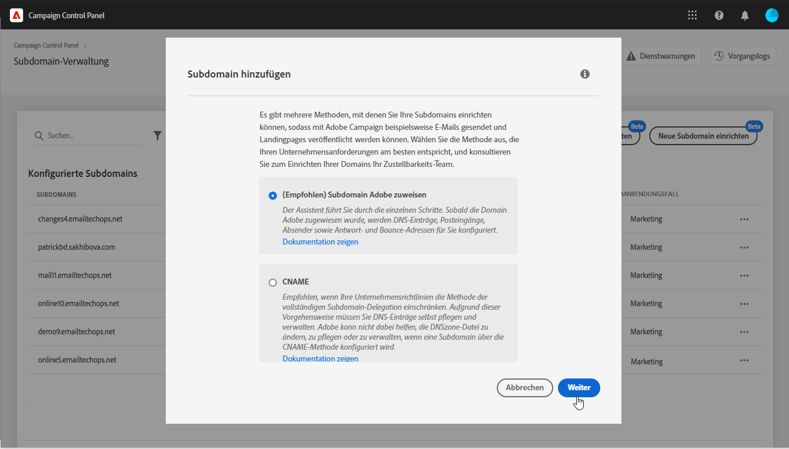
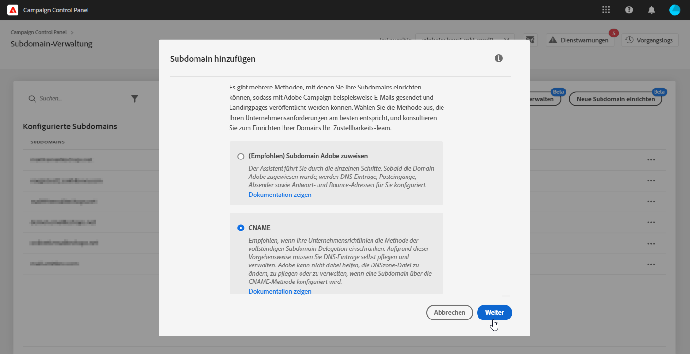
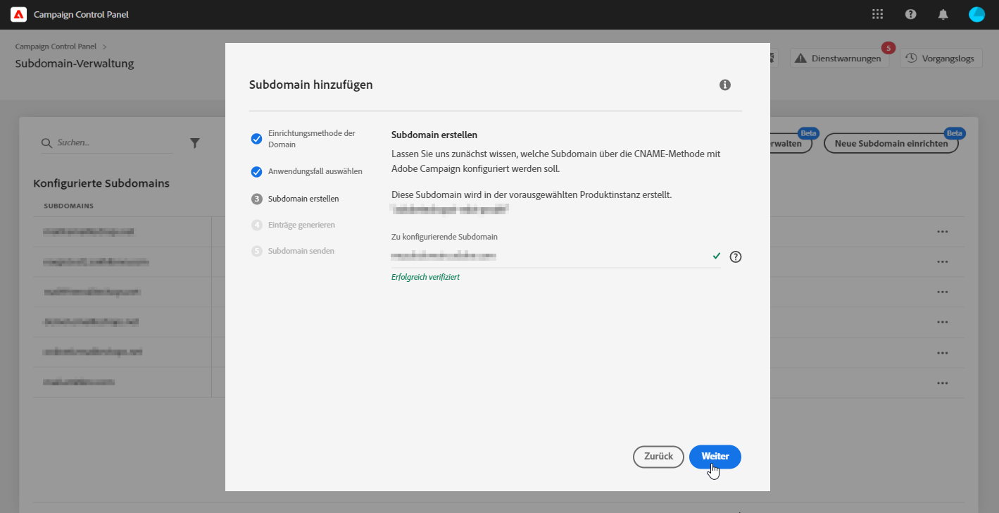
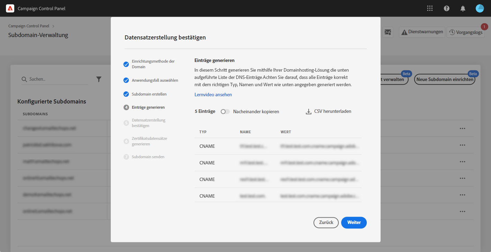
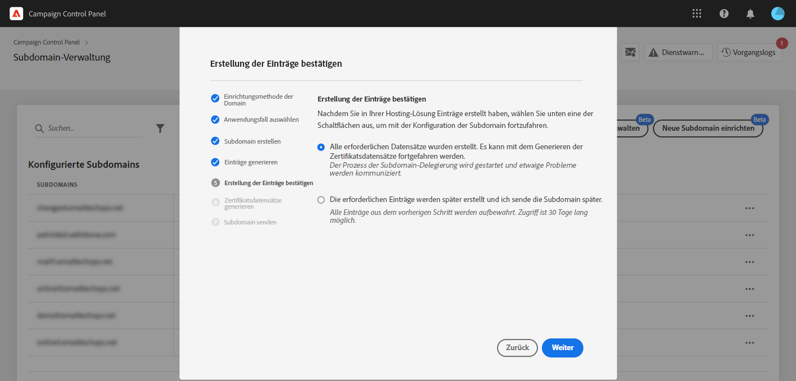

# Einrichten einer neuen Subdomain {#setting-up-subdomain}

>[!CONTEXTUALHELP]
>id="cp_subdomain_management"
>title="Einrichten neuer Subdomains und Verwalten von Zertifikaten"
>abstract="Sie müssen eine neue Subdomain einrichten und die SSL-Zertifikate Ihrer Subdomains verwalten, um mit Adobe Campaign E-Mails senden oder Landingpages veröffentlichen zu können."
>additional-url="https://experienceleague.adobe.com/docs/control-panel/using/subdomains-and-certificates/monitoring-ssl-certificates.html?lang=de" text="Überwachen von SSL-Zertifikaten"

## Wichtige Informationen {#must-read}

>[!IMPORTANT]
>
>Die Subdomain-Konfiguration über das Control Panel befindet sich in der Betaversion und unterliegt häufigen Aktualisierungen und Änderungen ohne Vorankündigung.

Auf dieser Seite finden Sie Informationen zum Einrichten neuer Subdomains mit der vollständigen Subdomain-Zuweisung oder mit CNAME. Globale Konzepte zu diesen beiden Methoden werden in diesem Abschnitt vorgestellt: [Subdomain-Branding](../../subdomains-certificates/using/subdomains-branding.md).

**Verwandtes Thema:**

* [Überwachen von Subdomains](../../subdomains-certificates/using/monitoring-subdomains.md)

### Instanzauswahl

Die Konfiguration von Subdomains ist nur für **Produktionsinstanzen** verfügbar.

Wenn die im Assistenten ausgewählte Instanz keine zuvor eingerichteten Subdomains hat, wird die erste konfigurierte Subdomain zur **primären Subdomain** für diese Instanz. Sie werden dies später nicht mehr ändern können. Daher werden **Reverse-DNS-Einträge** für andere Subdomains mithilfe dieser primären Subdomain erstellt. **Außerdem werden über die primäre Subdomain Antwort- und Bounce-Adressen für andere Subdomains generiert.**

### Nameserver-Konfiguration

Achten Sie beim Konfigurieren von Nameservern darauf, **Adobe nie Ihre Stamm-Subdomain zuzuweisen**. Andernfalls kann die Domain nur mit Adobe verwendet werden. Eine andere Verwendung ist dann nicht möglich, wie z. B. das Senden interner E-Mails an die Mitarbeiter Ihrer Organisation.

Erstellen Sie außerdem **keine separate Zonendatei** für diese neue Subdomain.

## Vollständige Subdomain-Zuweisung {#full-subdomain-delegation}

>[!CONTEXTUALHELP]
>id="cp_add_new_subdomain"
>title="Neue Subdomain hinzufügen"
>abstract="Adobe empfiehlt die vollständige Delegation von Subdomains. Sie können jedoch CNAMEs oder benutzerdefinierte Methoden verwenden, um Ihre Subdomains einzurichten."
>additional-url="https://experienceleague.adobe.com/docs/control-panel/using/subdomains-and-certificates/setting-up-new-subdomain.html?lang=de" text="Einrichten einer neuen Subdomain"
>additional-url="https://helpx.adobe.com/de/enterprise/using/support-for-experience-cloud.html" text="Kundenunterstützung kontaktieren"

>[!CONTEXTUALHELP]
>id="cp_add_subdomain_create_delegate"
>title="Subdomain erstellen und delegieren"
>abstract="Erstellen Sie die Subdomain, die Sie mit Adobe Campaign in Ihrer Hosting-Lösung verwenden möchten, und delegieren Sie sie an Adobe."
>additional-url="https://experienceleague.adobe.com/docs/control-panel/using/subdomains-and-certificates/setting-up-new-subdomain.html" text="Einrichten einer neuen Subdomain"

>[!CONTEXTUALHELP]
>id="cp_add_subdomain_submit"
>title="Subdomain übermitteln"
>abstract="Bestätigen und senden Sie die in den vorherigen Schritten konfigurierte Subdomain."
>additional-url="https://experienceleague.adobe.com/docs/control-panel/using/subdomains-and-certificates/setting-up-new-subdomain.html" text="Einrichten einer neuen Subdomain"

Gehen Sie wie folgt vor, um eine Subdomain Adobe Campaign vollständig zuzuweisen.

 Entdecken Sie diese Funktion im Video mit [Campaign Classic](https://experienceleague.adobe.com/docs/campaign-classic-learn/control-panel/subdomains-and-certificates/subdomain-delegation.html?lang=de#subdomains-and-certificates) oder [Campaign Standard](https://experienceleague.adobe.com/docs/campaign-standard-learn/control-panel/subdomains-and-certificates/subdomain-delegation.html?lang=de#subdomains-and-certificates).

1. Wählen Sie auf der Karte **[!UICONTROL Subdomains &amp; Zertifikate]** die gewünschte Produktionsinstanz und danach **[!UICONTROL Neue Subdomain einrichten]** aus.

   

1. Wählen Sie **[!UICONTROL Weiter]** aus, um die Methode der vollständigen Zuweisung zu bestätigen.

   

1. Erstellen Sie die gewünschte Subdomain und die gewünschten Nameserver in der von Ihrem Unternehmen verwendeten Hosting-Lösung. Kopieren Sie dazu die im Assistenten angezeigten Adobe-Nameserver-Informationen und fügen Sie sie ein. Weitere Informationen zum Erstellen einer Subdomain in einer Hosting-Lösung finden Sie in diesem [Tutorial-Video](https://video.tv.adobe.com/v/30175).

   >[!NOTE]
   >
   > Bei Adobe Campaign Standard können Sie über zugewiesene Subdomains sowohl **Marketing**- als auch **Transaktions**-Nachrichten senden.

   

1. Nachdem die Subdomain mit den entsprechenden Adobe-Nameserver-Informationen erstellt wurde, wählen Sie **[!UICONTROL Weiter]** aus.

1. Wenn Sie eine Campaign Classic-Instanz ausgewählt haben, wählen Sie den gewünschten Anwendungsfall für die Subdomain aus: **Marketingnachrichten** oder **Transaktions- und Betriebsnachrichten**. Globale Konzepte zu den Anwendungsfällen von Subdomains werden in [diesem Abschnitt](../../subdomains-certificates/using/subdomains-branding.md#about-subdomains-use-cases) vorgestellt.

   

1. Geben Sie die von Ihnen erstellte Subdomain in Ihre Hosting-Lösung ein und wählen Sie dann **[!UICONTROL Senden]** aus.

   Vergewissern Sie sich, dass Sie den **vollständigen Namen** der zuzuweisenden Subdomain eingeben. Um beispielsweise die Subdomain &quot;usoffer.email.weretail.com&quot; zuzuweisen, geben Sie &quot;usoffer.email.weretail.com&quot; ein.

   

Sobald die Subdomain gesendet wurde, führt das Control Panel verschiedene Prüfungen und Konfigurationsschritte durch. Weitere Informationen hierzu finden Sie unter [Subdomain-Prüfungen und -konfiguration](#subdomain-checks-and-configuration).

## Subdomain-Konfiguration mit CNAME {#use-cnames}

>[!CONTEXTUALHELP]
>id="cp_add_cname_subdomain_create_delegate"
>title="Subdomain konfigurieren"
>abstract="Geben Sie in diesem Bildschirm die Subdomain an, die Sie mit CNAMEs konfigurieren möchten."
>additional-url="https://experienceleague.adobe.com/docs/control-panel/using/subdomains-and-certificates/setting-up-new-subdomain.html" text="Einrichten einer neuen Subdomain"

>[!CONTEXTUALHELP]
>id="cp_add_cname_records"
>title="Einträge generieren"
>abstract="Navigieren Sie zu Ihrer Hosting-Lösung, um die Liste der in diesem Bildschirm angezeigten DNS-Einträge zu generieren."
>additional-url="https://experienceleague.adobe.com/docs/control-panel/using/subdomains-and-certificates/setting-up-new-subdomain.html" text="Einrichten einer neuen Subdomain"

>[!CONTEXTUALHELP]
>id="cp_add_cname_subdomain_submit"
>title="Subdomain übermitteln"
>abstract="Bestätigen und senden Sie die in den vorherigen Schritten konfigurierte Subdomain."
>additional-url="https://experienceleague.adobe.com/docs/control-panel/using/subdomains-and-certificates/setting-up-new-subdomain.html" text="Einrichten einer neuen Subdomain"

Gehen Sie wie folgt vor, um eine Subdomain mit CNAME zu konfigurieren.

 Entdecken Sie diese Funktion im Video mit [Campaign Classic](https://experienceleague.adobe.com/docs/campaign-classic-learn/control-panel/subdomains-and-certificates/delegating-subdomains-using-cname.html?lang=de#subdomains-and-certificates) oder [Campaign Standard](https://experienceleague.adobe.com/docs/campaign-standard-learn/control-panel/subdomains-and-certificates/delegating-subdomains-using-cname.html?lang=de).

1. Wählen Sie auf der Karte **[!UICONTROL Subdomains &amp; Zertifikate]** die gewünschte Produktionsinstanz und danach **[!UICONTROL Neue Subdomain einrichten]** aus.

   

1. Wählen Sie die **[!UICONTROL CNAME]**-Methode aus und klicken Sie dann auf **[!UICONTROL Weiter]**.

   

1. Wenn Sie eine Campaign Classic-Instanz ausgewählt haben, wählen Sie den gewünschten Anwendungsfall für die Subdomain aus: **Marketingnachrichten** oder **Transaktions- und Betriebsnachrichten**. Globale Konzepte zu den Anwendungsfällen von Subdomains werden in [diesem Abschnitt](../../subdomains-certificates/using/subdomains-branding.md#about-subdomains-use-cases) vorgestellt.

   

1. Geben Sie die von Ihnen erstellte Subdomain in Ihre Hosting-Lösung ein und wählen Sie dann **[!UICONTROL Weiter]** aus.

   Vergewissern Sie sich, dass Sie den **vollständigen Namen** der einzurichtenden Subdomain eingeben. Um beispielsweise die Subdomain „usoffer.email.weretail.com“ zu konfigurieren, geben Sie „usoffer.email.weretail.com“ ein.

   

1. Die Liste der Einträge, die auf Ihren DNS-Servern gespeichert werden sollen, wird angezeigt. Kopieren Sie diese Einträge entweder einzeln oder durch Herunterladen einer CSV-Datei, und navigieren Sie dann zu Ihrer Domain-Hosting-Lösung, um die passenden DNS-Einträge zu generieren.

   

1. Stellen Sie sicher, dass alle DNS-Einträge aus den vorherigen Schritten in Ihrer Domain-Hosting-Lösung generiert wurden. Wenn alles richtig konfiguriert ist, wählen Sie die erste Aussage aus und klicken Sie dann zur Bestätigung auf **[!UICONTROL Senden]**.

   

   >[!NOTE]
   >
   >Wenn Sie die Einträge erstellen und die Subdomain-Konfiguration später senden möchten, wählen Sie die zweite Aussage aus und klicken Sie dann auf **[!UICONTROL Später senden]**. Sie können dann die Konfiguration der Subdomain direkt über den **[!UICONTROL Verarbeitungsbereich]** des Bildschirms zur Subdomain-Verwaltung fortsetzen.
   >
   >Beachten Sie, dass DNS-Einträge, die auf Ihrem Server abgelegt werden sollen, vom Control Panel 30 Tage lang aufbewahrt werden. Nach diesem Zeitraum müssen Sie die Subdomain von Grund auf neu konfigurieren.

Sobald die Subdomain gesendet wurde, führt das Control Panel verschiedene Prüfungen und Konfigurationsschritte durch. Weitere Informationen hierzu finden Sie unter [Subdomain-Prüfungen und -konfiguration](#subdomain-checks-and-configuration).

## Subdomain-Prüfungen und -Konfiguration {#subdomain-checks-and-configuration}

1. Nachdem eine Subdomain übermittelt wurde, prüft das Control Panel, ob sie korrekt auf Adobe-NS-Einträge verweist. Zusätzlich wird sichergestellt, dass für diese Subdomain kein SOA-Eintrag (Start of Authority) existiert.

   >[!NOTE]
   >
   >Beachten Sie, dass während der Ausführung der Subdomain-Konfiguration andere Anfragen über das Control Panel in einer Warteschlange gereiht und erst nach Abschluss der Subdomain-Konfiguration ausgeführt werden, um Leistungsprobleme zu vermeiden.

1. Wenn die Prüfungen erfolgreich sind, beginnt das Control Panel mit der Einrichtung der Subdomain mit DNS-Einträgen, zusätzlichen URLs, Posteingängen usw.

   

   Wählen Sie **[!UICONTROL Details]** für die Subdomain-Konfiguration aus, um weitere Informationen zum Konfigurationsfortschritt zu erhalten.

   

1. Schließlich wird das **Zustellbarkeitsteam** über die neue Subdomain informiert, um sie zu prüfen. Der Prüfvorgang kann bis zu 10 Werktage dauern, nachdem die Subdomain konfiguriert wurde.

   >[!IMPORTANT]
   >
   >Die durchgeführten Zustellbarkeitsprüfungen umfassen das Testen von Feedback-Schleifen und Spam-Beschwerdeschleifen. Daher empfehlen wir nicht, die Subdomain vor Abschluss der Prüfung zu verwenden, da dies zu einer schlechten Reputation der Subdomain führen kann.
   >
   >Beachten Sie jedoch, dass Sie Vorgänge im Zusammenhang mit SSL-Zertifikaten in Ihrer Subdomain durchführen können, auch wenn die Zustellbarkeitsprüfung noch läuft.

1. Am Ende des Prozesses werden die Subdomains für die Verwendung mit Ihrer Adobe Campaign-Instanz konfiguriert und die folgenden Elemente erstellt:

   * **Die Subdomain mit den folgenden DNS-Einträgen**: SOA, MX, CNAME(s), DKIM, SPF, TXT,
   * **Zusätzliche Subdomains** zum Hosten von Mirror-, Ressourcen- und Tracking-Seiten sowie von Domain-Schlüsseln,
   * **Postfächer**: Absender, Fehler, Antwort.

   Standardmäßig ist das „Antwort“-Postfach über das Control Panel so konfiguriert, dass E-Mails gelöscht werden, und kann nicht überprüft werden. Verwenden Sie diese Adresse nicht, wenn Sie Ihr „Antwort“-Postfach für Ihre Marketingkampagnen überwachen möchten.

Klicken Sie auf **[!UICONTROL Details der Subdomain]** und **[!UICONTROL Absenderdetails]**, um weitere Informationen zur Subdomain zu erhalten.

## Fehlerbehebung {#troubleshooting}

* In einigen Fällen wird die Subdomain-Konfiguration durchgeführt, die Subdomain wird jedoch möglicherweise nicht erfolgreich verifiziert. Die Subdomain verbleibt mit einem Vorgangslog mit Informationen zum Fehler in der Liste **[!UICONTROL Konfiguriert]**. Wenden Sie sich an die Kundenunterstützung, wenn Sie Probleme bei der Lösung des Problems haben.
* Wenn die Subdomain nach der Konfiguration als &quot;Nicht verifiziert&quot; angezeigt wird, starten Sie eine neue Subdomain-Verifizierung (**...** / **[!UICONTROL Subdomain verifizieren]**). Wenn immer noch derselbe Status angezeigt wird, kann dies daran liegen, dass einige Anpassungen am Empfängerschema vorgenommen wurden, die mit Standardprozessen nicht überprüft werden können. Versuchen Sie, über diese Subdomain eine Kampagne zu senden.
* Wenn die Konfiguration der Subdomain bei der Zustellbarkeitsprüfung zu lange dauert (mehr als 10 Werktage), wenden Sie sich an die Kundenunterstützung.
